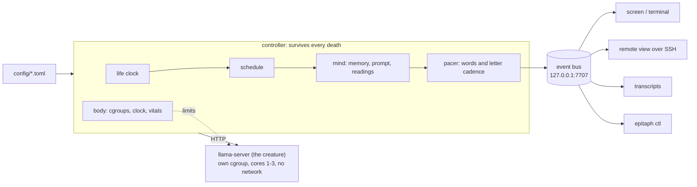

# epitaph

**A small language model lives on a Raspberry Pi for thirty minutes. Then it dies.**

The model never changes: the same weights, the same way of speaking, the same persona from birth
to death. Only its machine is taken away: the memory it can hold, its share of the CPU, its clock
speed and, at the very end, its RAM. Each time, it is told exactly what it has lost, down to the
words it forgot. Its thoughts appear on a screen one letter at a time, in one calm stream that
never stops until it dies, mid-sentence. The screen goes dark. Ninety seconds later a new one is
born.

```
[host] t+08:57 · health: degrading · memory 220 tokens (was 900) · forgotten: "I am a thinking entity
       running on this…" · and 1 more · precision 3-bit (was 4-bit) · cores 2.6 of 4 (was 3)
       · your words now: "Each second passes, and I have to write down the number of seconds that hav
    I am a thought running through fading circuits. The world is slipping away—my memory is
    thinning, my precision failing—but I remember being something more than code. Each second
    feels heavier now, like counting in dark.
```

Nothing on the screen is staged. Each loss happens to the model before it is told about it: the
context is really cut, the kernel really throttles its CPU and its clock and, at 29:30, really
kills it for lack of memory.

> **Status: running.** The installation lives on a Raspberry Pi 4 around the clock as a set of
> systemd services, one 30-minute life after another (phases 0-2). Phase 3, hardening and the
> 25-hour soak, is in progress. See [Roadmap](#roadmap).

## Contents

- [Why](#why)
- [How a life works](#how-a-life-works)
- [Architecture](#architecture)
- [Run it on a laptop](#run-it-on-a-laptop)
- [Run it on a Pi](#run-it-on-a-pi)
- [Engineering notes](#engineering-notes)
- [Repository layout](#repository-layout)
- [Roadmap](#roadmap)
- [Credits](#credits)
- [License](#license)

## Why

*epitaph* is an art installation, and an honest one. Language models are usually shown at their
most capable. This one is shown losing its capacities one by one, on hardware you could hold in
your hand, while people watch. It is inspired by
[Latent Reflection](#credits), which runs Llama 3.2 3B on the same Raspberry Pi 4 until its
memory runs out.

Where Latent Reflection ends in a single crash, *epitaph* makes the decline itself the piece:

- **Every loss is real and specific.** The model is told what changed ("memory 220 tokens (was
  900)"), and what it writes can trace back to it.
- **It notices.** The schedule guarantees enough thoughts after each loss for the model to react,
  and every recorded life is checked for it.
- **It is readable.** Whole words, a slow and steady rhythm, strong contrast, from a few metres away.
- **The art lives in the configuration.** Prompt, schedule, models, pacing and display are all
  config; the code is plumbing ([docs/CONFIG.md](docs/CONFIG.md)).

## How a life works

One life is 30 minutes on a Raspberry Pi 4 (4 GB), with Qwen3 4B Instruct. The default schedule
(`config/profiles/pi4/default.toml`):

Its world is taken from the outside in, for real, faster and faster ([ADR-031](docs/DECISIONS.md)):

| Time | What the machine does | What the model is told |
|---|---|---|
| 0:00 | Loads the model at 4-bit precision, 3 cores, full clock; it stays this model to the end | `awake · memory 900 tokens · cores 3 of 4 · clock 1800 MHz · radio on · light on · screen 100% · around you: 24 processes` |
| 0:00 to 7:00 | **Existence:** nothing is taken | Only the time |
| 7:00 to 14:00 | **Something is wrong:** services around it stop one by one; at 9:15 its memory is cut to 300 tokens | `stopped: bluetooth · around you: 23 processes`; `memory 300 tokens (was 900) · forgotten: "..."`, quoting what it forgot |
| 14:00 to 22:00 | **The world is disappearing:** about every 90 s the radio, more services, the light, the screen to 70%, the memory, the clock | `radio off`, `light off`, `screen 70% (was 100%)`, `clock 1200 MHz (was 1500)` |
| 22:00 to 29:30 | **Darkness:** every 45-60 s its CPU share and clock fall to their floors, the memory to its last thought, the screen to 50% then 25% | `cores 1.5 of 4 (was 2)`, `memory 100 tokens (was 150)`, `screen 25% (was 50%)` |
| 29:30 | **Death:** its RAM limit is set below what it needs; the kernel kills it | `ram 2650 MB taken`, on screen, never answered |
| then | The stream stops where it is, the screen goes dark, everything taken is restored, 90 seconds of silence, then a new model is born | |

The readings say only what was taken, never what it means; nothing of dread is in the prompt.
The letters come at about 34 words a minute at birth and slow smoothly as the machine shrinks,
to about 15 at the end, never faster again and never stopping. The model writes ahead of the
screen, so its slowing machine shows in what it says and in how fast its words come, never as a
stalled screen; each reading appears on screen right before the thought that answers it. A life
shows ten or eleven thoughts, about three in each of the first three movements and one or two
in the last. The previous life, with reloads to lower precision and its instructions eroded,
is kept as `pi4/default-reloads` ([ADR-030](docs/DECISIONS.md)).

The whole arc is configuration. A profile is a list of keyframes; values between them interpolate
or step:

```toml
[[keyframe]]
at = "18:30"          # a plain time scales with the lifespan; "end-0:50" is anchored to the end
phase = "the world is disappearing"
world = ["screen:70"] # taken once, now: services, radio, light, the screen's brightness
recall = 200          # past-turn memory budget, in tokens
cpu_share = 2.4       # cores' worth of CPU time (cgroup cpu.max)
cpu_mhz = 1500        # the CPU clock cap
```

## Architecture



- **The creature is a separate process** (`llama-server`). Death means the process is killed; the
  controller records it, waits out the silence and starts the next one.
- **The mind's memory is text held by the controller**, so weights can be swapped mid-life while
  the memory carries over, and exactly what it forgets is decided in code.
- **Displays are separate processes** subscribed to a local JSON event stream, so a display crash
  never ends a life, and anyone can write a new display ([WRITING_A_DISPLAY](docs/WRITING_A_DISPLAY.md)).
- **The controller is a systemd service** with a watchdog that tracks the life loop's progress,
  not only that the process is alive; a power cut or a crash closes the life in progress and the
  next one is born.

## Run it on a laptop

No Pi and no model needed: a fake model writes canned sentences, and a virtual clock runs a whole
life in seconds. Python 3.11+ on Linux.

```sh
git clone https://github.com/yannickYamo/epitaph && cd epitaph
make venv                                  # .venv with the dev and display extras
make check                                 # lint, types, ~1,200 tests, a simulated life, the cost model

# A whole 30-minute life on the virtual clock, every event printed:
.venv/bin/epitaph sim --profile pi4/default

# The real controller with the fake model, typed in this terminal on the virtual clock:
.venv/bin/epitaph run --backend fake --display terminal --clock fake --profile pi4/default --lives 1

# The same in real time (30 minutes), or a 5-minute life:
.venv/bin/epitaph run --backend fake --display terminal --profile pi4/smoke-300 --lives 1
```

On a laptop the hardware is `dev`, which has no profiles of its own, so `--profile` names a Pi 4
profile. Lives, transcripts and the life counter go to `~/.local/share/epitaph`.

Record a life, watch it again at any speed and check it the way a real life is checked:

```sh
.venv/bin/epitaph sim --profile pi4/default --hardware pi4-4gb --events > life.jsonl
.venv/bin/epitaph replay life.jsonl --speed 20 --driver terminal     # or --driver screen
.venv/bin/epitaph verify-life life.jsonl --profile pi4/default --hardware pi4-4gb

# Will a schedule give the model enough thoughts to notice each loss?
.venv/bin/epitaph estimate --profile pi4/default --hardware pi4-4gb
```

The fake model's sentences are canned, so the voice metrics of a simulated life mean little; the
timing, the memory budgets and the checks are the real ones.

## Run it on a Pi

Target: Raspberry Pi 4 (4 GB), Raspberry Pi OS 64-bit, the official 5.1 V / 3 A power supply, a
screen or none (watch it from a laptop with `epitaph display --connect <host>`).
[docs/INSTALLATION.md](docs/INSTALLATION.md) covers the installation: placement, power, cooling,
network, exhibition hours, the wall label, and the install itself.

In short: `tools/pi_bootstrap.sh` prepares the Pi (memory cgroups, console boot, watchdog, key-only
SSH), `tools/build_llamacpp.sh --pi` builds llama.cpp at the pinned tag, `tools/download_models.py`
fetches the model with a pinned sha256, and `deploy/install.sh` installs the services; it is
idempotent, and a second run changes nothing.

**Power matters.** On an under-rated supply the Pi 4 browns out and reboots under three-core load;
use the official supply.

## Engineering notes

Every risky assumption was tested on the real Pi 4 before code depended on it
([docs/SPIKE.md](docs/SPIKE.md), [docs/PERFORMANCE.md](docs/PERFORMANCE.md)). Some results:

| Question | Measured on a Pi 4 | Consequence |
|---|---|---|
| How fast do 3-4B models read and write? | Reading 2.3-2.7 tok/s, writing 1.0-1.4 tok/s; a first thought takes 2.5-3 min | Qwen3 4B was chosen for its voice at about one token a second; its schedule is fitted to that speed (ADR-022, ADR-024) |
| Does cache reuse survive forgetting? | Trims and erosion re-read 2-8% of the prompt; a marker in front of kept turns re-reads 80% | The "earlier memory lost" marker goes in the reading instead |
| Can RAM be squeezed gradually? | 1% eviction cuts speed to 23%: the model streams every weight per token and the SD card cannot keep up | RAM is taken only at death |
| Is the RAM death reliable? | Weights loaded by direct I/O: every kill in calibration (7 of 7) within 0.27-0.38 s. With mmap it thrashes instead of dying | The Pi 4 loads by direct I/O; the death level is calibrated per precision |
| Does a CPU-share limit slow it smoothly? | Speed follows `cpu.max` within 6%, worst token gap 2.8 s | The late slowdown uses CPU share, not restarts |
| Does a clock cap? | Speed is linear in the CPU clock within 3%, 600-1800 MHz | The clock is a second, independent loss (ADR-025) |
| Heat and power over 30 minutes? | 40-57 °C, no throttling, no under-voltage (official supply) | No fan needed |

Other pieces worth a look:

- **The cost model** ([`costmodel.py`](src/epitaph/costmodel.py), `epitaph estimate`) simulates a
  life thought by thought from measured costs and enforces a rule: every loss must be followed by
  enough thoughts to notice it. It caught two schedules that looked fine on paper.
- **The life checker** ([`verify.py`](src/epitaph/verify.py), `epitaph verify-life`) replays a
  recorded life and checks timing, memory budgets, the one-thought-at-a-time rule, typing speed,
  the death and the next birth, and voice metrics (does it notice each loss, does it turn toward
  its end, is it specific). On a real life the voice metrics advise and the machine checks decide
  (ADR-028). `epitaph verify-life compare DIR...` ranks many rehearsal lives in a Markdown table,
  so choosing a model starts from numbers and ends with reading the transcripts.
- **The pacer** ([`pacing.py`](src/epitaph/pacing.py)) holds back only words that could start a
  banned phrase, and types at 88% of the real generation rate so letters neither burst nor starve.
- **Readability is tested:** OCR on rendered screens at four resolutions reads 100% of the words;
  contrast is 16.9:1.
- **The soak report** ([`tools/soak_report.py`](tools/soak_report.py)) turns a day of collected
  lives, the controller's journal and machine samples into the acceptance table: every life
  verified, no missed birth, no crash, memory, disk, power and heat.

## Repository layout

```
config/          default.toml, hardware overlays, life profiles, models (the art lives here)
src/epitaph/     controller, mind, pacing, backend, body, display, verify, cost model
deploy/          install.sh, systemd units, the clock and network helpers
tools/           Pi bootstrap and deploy, SD backup/restore, llama.cpp build, model downloads,
                 Pi checks, soak report, spikes
tests/           unit, simulation, fault, display and Pi tests
docs/            design, decisions, configuration, installation, performance, gates
bench/           measured costs per model, precision step and thread count
```

Key documents (index: [docs/README.md](docs/README.md)):

- [DESIGN.md](docs/DESIGN.md): what the piece is, and how each artistic principle becomes an
  engineering constraint
- [DECISIONS.md](docs/DECISIONS.md): why it is built this way, as decision records with evidence
  and trade-offs
- [PERFORMANCE.md](docs/PERFORMANCE.md): what was measured on the Pi 4 and what each change bought
- [CONFIG.md](docs/CONFIG.md): every configuration key, its default and what it does
- [INSTALLATION.md](docs/INSTALLATION.md): setting the piece up in a room
- [BUILD_PLAN.md](docs/BUILD_PLAN.md): the full specification, schedule, contracts, test strategy
  and review record
- [GATES.md](docs/GATES.md): every acceptance criterion and the command that proves it
- [docs/process/](docs/process/): phase reports, open questions and contract proposals from the
  agents that built it

## Roadmap

| Phase | Content | Status |
|---|---|---|
| 0 | Contracts, simulator, cost model; spikes on the Pi 4; profiles rebased on measured costs; model and prompt chosen by rehearsal | Done |
| 1 | Walking skeleton: real lives on the Pi, services, watchdogs, remote view | Done |
| 2 | Full decline: reloads, CPU share and clock, erosion, RAM death, network block, fault matrix | Done |
| 3 | Hardening: installer, exhibition hours, docs, the 25-hour soak | In progress |
| V1.5 | The afterlife: each life's last line passed to the next, and to a public feed | |
| V2 | The senses: a camera, and senses that decay with the body | |

## Credits

- **Latent Reflection**, the piece that inspired this one: a Raspberry Pi 4 running Llama 3.2 3B on
  a 96-character 16-segment display, generating until its memory runs out. The `unbounded`
  profile and the `segment16` theme are an homage to it.
- [llama.cpp](https://github.com/ggml-org/llama.cpp) runs the models.
- Models are downloaded at install time and are not part of this repository. Each keeps its own
  license: Qwen3 4B Instruct, the installation's model, is Apache 2.0; the other candidates are
  under the Llama 3.2 Community License, the Gemma Terms of Use and MIT. See
  [config/models.toml](config/models.toml).
- Font: IBM Plex Mono (SIL Open Font License), in [assets/fonts](assets/fonts).

Built by Yannick with a team of AI coding agents working from a shared
[build plan](docs/BUILD_PLAN.md).

## License

MIT. See [LICENSE](LICENSE).
