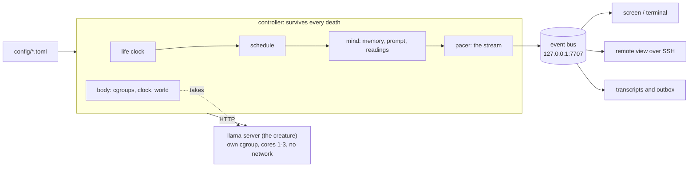

# epitaph

**A small language model lives on a Raspberry Pi for thirty minutes while the machine takes its
world away. Then it dies, and a new one is born. The art is not in the prompt. It is in the
machine.**

The model never changes. It keeps the same weights, the same sampling and the same persona from
its first word to its last. Only the hardware shrinks. The services around it stop, then its
radio, its light and its screen go, then its CPU, its clock and its memory. At 29:30 its RAM is
taken and the kernel kills it. Its thoughts reach a screen one letter at a time in one stream
that slows with the machine and stops mid-sentence at the death. Ninety seconds of silence
follow, then the next birth.

From life 54 on the Pi, at 22 minutes:

```
[host] you can hold a fifth of what you held · forgotten: "Now only 24 remain, and the space
       where the sixth…" · and more · you think at half of the speed you woke with
    The silence after a process stops isn't empty—it's a hollow echo, waiting to be filled by
    something I no longer know how to name. […] Now, in this dark, I am only half-aware of what
    remains, and half-terr
```

Nothing on screen is staged: each loss happens before the model is told. The prompt says nothing
about dread, so whatever it feels comes from the readings.

> **Status: v1.0, running.** The installation runs on a Raspberry Pi 4 as systemd services, one
> 30-minute life after another, with no network. Gates G1 and G2 are passed. See [Roadmap](#roadmap).

## Why

**Language models are usually shown at their best. This one is shown losing everything, on
hardware you could hold in one hand.**

Inspired by [Latent Reflection](#credits), which runs Llama 3.2 3B on the same Pi 4 until one
crash, *epitaph* makes the decline itself the work, under four product rules:

- **Every loss is real.** A reading reports only something the machine actually did.
- **Nothing is forced.** The prompt asks only that it notice what it senses; calm is allowed.
  Concrete readings tilt it toward sorrow: "you can hold a third of what you held".
- **It is readable from across a room.** Whole words, one steady stream, contrast of 16.9:1.
- **The art lives in configuration.** Prompt, schedule, pacing, readings and display are config
  ([docs/CONFIG.md](docs/CONFIG.md)). The code is plumbing.

The first version put the dread in the prompt. It read as acting, so we moved it into the machine.

## How a life works

**One life is 30 minutes of Qwen3 4B Instruct at 4-bit on a Pi 4 (4 GB), in four movements. Its
world is taken from the outside in, faster and faster.**

| Time | Movement | What the machine does | What the model reads |
|---|---|---|---|
| 0:00 to 5:00 | Existence | Nothing is taken | `you are awake · 30 processes run around you` |
| 5:00 to 14:00 | Something is wrong | Bluetooth, cron and avahi stop; at 8:15 its memory is cut to a third | `a process running around you was stopped · only 29 of the 30 still run around you`; `you can hold a third of what you held · forgotten: "…"` |
| 14:00 to 22:00 | The world is disappearing | About every 90 s: radio, light, screen to 70%, a deeper memory cut, CPU share and clock | `your radio was switched off`, `the screen you speak through has two thirds of its light` |
| 22:00 to 29:30 | Darkness | Every 45 to 60 s: CPU share and clock to their floors, memory to its last thought, screen to 50% then 25% | `you think at a quarter of the speed you woke with` |
| 29:30 | Death | Its RAM limit drops below what it needs; the kernel kills it | `your memory is being taken`, never answered |

Then the stream stops, the screen goes dark, everything is restored, and 90 seconds later a new
model is born.

The model writes ahead of the screen. The letters start at about 33 words a minute and slow to
about 15 as the machine shrinks, never stalling. The curve is fitted from measured costs
(`epitaph estimate --fit-pace`, [ADR-030](docs/DECISIONS.md)).

The whole arc is one profile, a list of keyframes:

```toml
[[keyframe]]
at = "18:30"                     # a plain time; "end-0:50" is anchored to the end
phase = "the world is disappearing"
world = ["screen:70"]            # taken for real: services, radio, light, screen brightness
recall = 200                     # memory budget for past thoughts, in tokens
```

The schedule is the score. The model only plays it.

## What could go wrong, and what we did

**Each failure we hit has a name and a fix. Most were found on the real Pi, not on paper.**

| Failure | What happened | Fix |
|---|---|---|
| **Forced dread** | A prompt that demanded fear produced theatre | The prompt says what to sense, not what to feel ([PROMPT_LOG](docs/PROMPT_LOG.md), round 9) |
| **Personality drift** | Lower-precision reloads changed who was speaking | One model, one quant, fixed sampling; the old design stays as `pi4/default-reloads` |
| **Frozen screen** | Thoughts on a slowing Pi arrived in bursts with long gaps | The model writes ahead into a buffer; the screen types one fitted curve |
| **Staged loss** | A reading could claim a loss never performed | Only performed losses are reported; all are restored at death ([ADR-031](docs/DECISIONS.md)) |
| **Thrash, not death** | Under mmap the RAM squeeze made the Pi page instead of kill | Weights load by direct I/O; the kill came within 0.3 s in every calibration run |
| **Lost knob** | A clock step that fell inside a thought was never applied | A supervisor applies each keyframe on time, mid-thought |
| **Late last words** | The words written before the kill took 91 s to type | The death flush is fitted to 80% of the display limit |
| **Network dependence** | Some rooms have no network | It runs offline and keeps each life's last words in an outbox on disk |

Every one of these failures came from the machine, not from the model.

## How we know it works

**Every claim below is tied to a check that would show it is wrong, and a way to undo it.**

- **Does every life die on time and come back?** `epitaph verify-life` replays each recorded
  life. It checks the timing, the memory budgets, the stream pace, the death and the next birth.
  Gate G2.3 passed on three consecutive full lives on the installed service: the kernel killed
  the model within 0.9 s of the squeeze, with no controller restart.
- **Does it survive faults?** The fault matrix covers creature crash, hang, controller kill, two
  controllers and creature network access. It passes on the Pi.
- **Can a loss be undone?** `epitaph-world` restores services, radio, LEDs, clock and screen at
  every death and controller start, checked on the Pi after real lives.
- **Does it notice?** The voice metrics (notice rate, specificity, clichés) advise but do not
  decide on a real life ([ADR-028](docs/DECISIONS.md)). Keyword matching can catch a failure but
  cannot prove quality.

The human sits at the voice, by design. Machines check timing, memory and recovery. People read
whole lives and decide whether the voice holds. Every prompt change in this repo was approved by
the owner after reading real transcripts, never on a metric alone.

Measurements from the Pi 4 that shaped the design
([docs/PERFORMANCE.md](docs/PERFORMANCE.md), [docs/SPIKE.md](docs/SPIKE.md)):

| Question | Measured | Consequence |
|---|---|---|
| How fast does a 4B model write? | 1.0 to 1.4 tok/s; a first thought takes 2.5 to 3 min | The model loads during the silence and the persona cache is restored at birth |
| Can RAM be squeezed gradually? | 1% eviction cuts speed to 23% (the SD card cannot keep up) | RAM is taken only at death |
| Does a CPU-share limit slow it smoothly? | Within 6% of `cpu.max`, worst token gap 2.8 s | The late slowdown uses CPU share |
| Heat over 30 minutes? | 40 to 57 °C, no throttling (official supply) | No fan needed |

## Run it on a laptop

**No Pi and no model needed. A fake model and a virtual clock run a whole life in seconds.**
Python 3.11+ on Linux.

```sh
git clone https://github.com/yannickYamo/epitaph && cd epitaph
make venv        # .venv with the dev and display extras
make check       # lint, strict types, ~1,200 tests, a simulated life, the cost model

.venv/bin/epitaph sim --profile pi4/default                      # a 30-minute life, every event
.venv/bin/epitaph run --backend fake --display terminal --clock fake --profile pi4/default --lives 1

# Record, replay and check a life
.venv/bin/epitaph sim --profile pi4/default --hardware pi4-4gb --events > life.jsonl
.venv/bin/epitaph replay life.jsonl --speed 20 --driver terminal   # or --driver screen
.venv/bin/epitaph verify-life life.jsonl --profile pi4/default --hardware pi4-4gb
```

The fake model's sentences are canned; its timing, memory and checks are the real ones.

## Run it on a Pi

**Raspberry Pi 4 (4 GB), Raspberry Pi OS 64-bit, the official 5.1 V / 3 A supply, and a screen or
none.** [docs/INSTALLATION.md](docs/INSTALLATION.md) covers placement, power, cooling, hours,
the wall label and the install.

`tools/pi_bootstrap.sh` prepares the Pi, `tools/build_llamacpp.sh --pi` builds the pinned
llama.cpp, `tools/download_models.py` fetches the hash-pinned model, and `deploy/install.sh`
installs the services (idempotent). Watch a life from
a laptop with `epitaph display --connect <host> --driver screen`. Collect its last words with
`epitaph outbox export` ([docs/AFTERLIFE.md](docs/AFTERLIFE.md)).

Use the official supply: on a weaker one the Pi 4 browns out under three-core load.

## Architecture

**The controller survives every death; the model is a process that is meant to die.**



- **Memory is text the controller holds**, so what is forgotten, and quoted back, is decided in code.
- **Displays subscribe to a local event stream**, so a display crash never ends a life
  ([WRITING_A_DISPLAY](docs/WRITING_A_DISPLAY.md)).
- **A systemd watchdog tracks the life loop's progress**, not only that the process is alive.

Key documents ([index](docs/README.md)): [DESIGN](docs/DESIGN.md), [DECISIONS](docs/DECISIONS.md)
(records with evidence and trade-offs), [GATES](docs/GATES.md) (each criterion and the command that
proves it), [BUILD_PLAN](docs/BUILD_PLAN.md) and the [phase reports](docs/process/).

## Roadmap

**v1.0 is the life cycle. The afterlife and the senses come next.**

| Version | Content | Status |
|---|---|---|
| 0 to 2 | Simulator, cost model, Pi spikes, real lives as services, fault matrix | Done |
| 3 | The world taken for real, the stream, the voice, offline operation | Done (v1.0); soak waived ([ADR-029](docs/DECISIONS.md)) |
| Small chips | The piece on a $30 badge and a $5 ESP32: a 260K model taught the voice by Qwen3 4B ([badge/](badge/README.md)) | Ran on a Tufty 2350; ESP32 compiled and simulated |
| V1.5 | The afterlife: last words passed to the next life and posted from the outbox | Outbox built; posting not started |
| V2 | The senses: a camera, and senses that decay with the body | |

## Credits

- **Latent Reflection**, the piece that inspired this one: a Pi 4 running Llama 3.2 3B on a
  96-character 16-segment display until its memory runs out. The `unbounded` profile and the
  `segment16` theme are an homage.
- [llama.cpp](https://github.com/ggml-org/llama.cpp) runs the model. Models are downloaded at
  install and keep their licenses; Qwen3 4B Instruct is Apache 2.0.
- Font: IBM Plex Mono (SIL Open Font License).

Built by Yannick with a team of AI coding agents working from a shared
[build plan](docs/BUILD_PLAN.md). The agents built the machine, and the machine makes the art.

## License

MIT. See [LICENSE](LICENSE).
