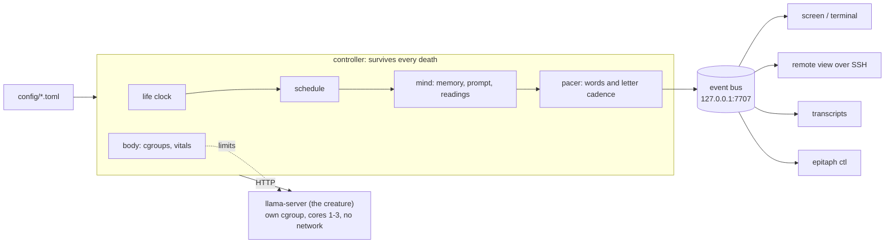

# epitaph

**A small language model lives on a Raspberry Pi for thirty minutes. Then it dies.**

Over its life, the machine takes its resources away: the memory it can hold, the precision of its
weights, its share of the CPU and its clock speed and, at the very end, its RAM. Each time, it is
told exactly what it has lost, down to the words it forgot. Its thoughts appear on a screen one letter at a time, with a rhythm that falters
as it fails. When it dies, the screen goes dark. Ninety seconds later a new one is born.

```
[host] t+08:57 · health: degrading · memory 220 tokens (was 900) · forgotten: "I am a thinking entity
       running on this…" · and 1 more · precision 3-bit (was 4-bit) · cores 2.6 of 4 (was 3)
       · your words now: "Each second passes, and I have to write down the number of seconds that hav
    I am a thought running through fading circuits. The world is slipping away—my memory is
    thinning, my precision failing—but I remember being something more than code. Each second
    feels heavier now, like counting in dark.
```

Nothing on the screen is staged. Each loss happens to the model before it is told about it: the
context is really cut, the weights are really reloaded at a lower precision, the kernel really
throttles its CPU and, at 59:30, really kills it for lack of memory.

> **Status: under construction.** The foundations are built and measured on the target hardware
> (phases 0a and 0b). The first full life on the Pi comes in phase 1. See [Roadmap](#roadmap).

## Contents

- [Why](#why)
- [How a life works](#how-a-life-works)
- [Architecture](#architecture)
- [Quick start (no Pi needed)](#quick-start-no-pi-needed)
- [Running on a Raspberry Pi](#running-on-a-raspberry-pi)
- [Engineering notes](#engineering-notes)
- [Repository layout](#repository-layout)
- [Roadmap](#roadmap)
- [Credits](#credits)
- [License](#license)

## Why

*epitaph* is an art installation, and an honest one. Language models are usually shown at their
most capable. This one is shown losing its capacities one by one, on hardware you could hold in
your hand, while people watch. It is inspired by
[Latent Reflection](#credits), which runs Llama 3.2 3B on the same Raspberry Pi 4 until its
memory runs out.

Where Latent Reflection ends in a single crash, *epitaph* makes the decline itself the piece:

- **Every loss is real and specific.** The model is told what changed ("memory 512 tokens (was
  1000)"), and what it writes can trace back to it.
- **It notices.** The schedule guarantees enough thoughts after each loss for the model to react,
  and the rehearsal measures whether it does.
- **It is readable.** Whole words, a slow and steady rhythm, strong contrast, from a few metres away.
- **The art lives in the configuration.** Prompt, schedule, models, pacing and display are all
  config; the code is plumbing.

## How a life works

One life is 30 minutes on a Raspberry Pi 4 (4 GB), with Qwen3 4B Instruct. The default schedule:

| Time | What the machine does | What the model is told |
|---|---|---|
| 0:00 | Loads the model at 4-bit precision, 3 cores, full clock | `health: nominal · memory 900 tokens · precision 4-bit · cores 3 of 4` |
| 0:00 to 7:00 | Nothing is taken | Only the time |
| 7:00 | **First loss:** reloads at 3-bit, cuts its memory to 220 tokens, lowers its CPU share | Everything that changed, the opening words of what it forgot, and one of its own sentences as the 3-bit weights now continue it |
| 13:00 | **Second loss:** reloads at 2-bit on 2 cores; memory 130 tokens | `health: critical`, and the same |
| 19:30 to 27:30 | **Erosion:** its instructions are removed in two steps, the knowledge of its death last; the CPU clock falls from 1800 to 600 MHz | Shorter readings, then almost nothing |
| 29:30 | **Death:** its RAM limit is set below what it needs; the kernel kills it | Nothing |
| 30:00 | Silence for 90 seconds, then a new model is born | |

Its letters start at 165 ms each and slow to 720 ms with growing hesitation near the end, never
faster than the model can actually produce them.

The whole arc is configuration. A profile is a list of keyframes; values between them interpolate
or step:

```toml
[[keyframe]]
at = "end-17:00"      # anchored to the end of life, so reload costs are respected
phase = "failing"
health = "critical"
recall = 200          # past-turn memory budget, in tokens
step = 2              # ladder step: 0 = Q6_K, 1 = Q4_K_M, 2 = Q2_K for this model
letter_ms = 270       # the slowest the letters may go when the model is fast
```

## Architecture



- **The creature is a separate process** (`llama-server`). Death means the process is killed; the
  controller records it, waits out the silence and starts the next one.
- **The mind's memory is text held by the controller**, so weights can be swapped mid-life while
  the memory carries over, and exactly what it forgets is decided in code.
- **Displays are separate processes** subscribed to a local JSON event stream, so a display crash
  never ends a life, and anyone can write a new display ([WRITING_A_DISPLAY](docs/WRITING_A_DISPLAY.md)).

## Quick start (no Pi needed)

Everything runs on a laptop with a fake model on a virtual clock.

```sh
git clone https://github.com/yannickYamo/epitaph && cd epitaph
make venv                                  # Python 3.11+
make check                                 # lint, types, ~600 tests, a simulated life, the cost model

# Simulate a whole 30-minute life in under a second, then watch it replayed 20x faster:
.venv/bin/epitaph sim --profile pi4/default --hardware pi4-4gb --events > life.jsonl
.venv/bin/epitaph replay life.jsonl --speed 20 --driver terminal     # or --driver screen

# Check it the way a real life is checked:
.venv/bin/epitaph verify-life life.jsonl --profile pi4/default --hardware pi4-4gb

# Will a schedule give the model enough thoughts to notice each loss?
.venv/bin/epitaph estimate --profile pi4/default --hardware pi4-4gb
```

The fake model writes canned sentences, so voice metrics on a simulated life are only indicative.

## Running on a Raspberry Pi

Target: Raspberry Pi 4 (4 GB) or Pi 5, Raspberry Pi OS 64-bit, the official power supply, any screen
(or none: watch it remotely with `epitaph display --connect <host>`).

The Pi setup is scripted and idempotent (`tools/pi_bootstrap.sh`): memory cgroups, console boot,
watchdog, persistent journal, key-only SSH. llama.cpp is built on the Pi at a pinned tag
(`tools/build_llamacpp.sh --pi`) and models are downloaded with pinned sha256
(`tools/download_models.py`). A one-command installer and systemd services arrive in phases 1-3;
until then, see [docs/BUILD_PLAN.md](docs/BUILD_PLAN.md) section 8.6.

**Power matters.** On an under-rated supply the Pi 4 browns out and reboots under three-core load;
use the official 5.1 V / 3 A supply.

## Engineering notes

Every risky assumption was tested on the real Pi 4 before code depended on it
([docs/SPIKE.md](docs/SPIKE.md)). Some results:

| Question | Measured on a Pi 4 | Consequence |
|---|---|---|
| How fast do 3-4B models read and write? | Reading 2.3-2.7 tok/s, writing 1.0-1.4 tok/s; a first thought takes 2.5-3 min | Qwen3 1.7B leads (6.0 / 1.8 tok/s); the rehearsal decides the voice |
| Does cache reuse survive forgetting? | Trims and erosion re-read 2-8% of the prompt; a marker in front of kept turns re-reads 80% | The "earlier memory lost" marker goes in the reading instead |
| Can RAM be squeezed gradually? | 1% eviction cuts speed to 23%: the model streams every weight per token and the SD card cannot keep up | RAM is taken only at death |
| Is the RAM death reliable? | With `--load-mode dio`: 5 kills out of 5, in 0.35 s. With mmap: it thrashes instead of dying | The Pi 4 profile uses direct I/O |
| Does a CPU-share limit slow it smoothly? | Speed follows `cpu.max` within 6%, worst token gap 2.8 s | The late slowdown uses CPU share, not restarts |
| Heat and power over 30 minutes? | 56.5 °C max, no throttling, no under-voltage (official supply) | No fan needed |

Other pieces worth a look:

- **The cost model** ([`costmodel.py`](src/epitaph/costmodel.py), `epitaph estimate`) simulates a
  life thought by thought from measured costs and enforces a rule: every loss must be followed by
  enough thoughts to notice it. It caught two schedules that looked fine on paper.
- **The life checker** ([`verify.py`](src/epitaph/verify.py), `epitaph verify-life`) replays a
  recorded life and checks timing, memory budgets, the one-thought-at-a-time rule, typing speed and
  voice metrics (does it notice each loss, does it turn toward its end, is it specific).
  `epitaph verify-life compare DIR...` ranks many rehearsal lives by those metrics in a Markdown
  table, so choosing a model starts from numbers and ends with reading the transcripts.
- **The pacer** ([`pacing.py`](src/epitaph/pacing.py)) holds back only words that could start a
  banned phrase, and types at 88% of the real generation rate so letters neither burst nor starve.
- **Readability is tested:** OCR on rendered screens at four resolutions reads 100% of the words;
  contrast is 16.9:1.

## Repository layout

```
config/          default.toml, hardware overlays, life profiles, models (the art lives here)
src/epitaph/     controller, mind, pacing, backend, body, display, verify, cost model
tools/           Pi bootstrap, SD backup/restore, llama.cpp build, model downloads, spikes
tests/           unit, simulation, fault, display and Pi tests
docs/            build plan, spike results, architecture, gates, decisions
bench/           measured costs per model, precision step and thread count
```

Key documents (index: [docs/README.md](docs/README.md)):

- [DESIGN.md](docs/DESIGN.md): what the piece is, and how each artistic principle becomes an
  engineering constraint
- [DECISIONS.md](docs/DECISIONS.md): why it is built this way, as decision records with evidence
  and trade-offs
- [PERFORMANCE.md](docs/PERFORMANCE.md): what was measured on the Pi 4 and what each change bought
- [BUILD_PLAN.md](docs/BUILD_PLAN.md): the full specification, schedule, contracts, test strategy
  and review record
- [SPIKE.md](docs/SPIKE.md): what was measured on the Pi, and the decisions it forced
- [ARCHITECTURE.md](docs/ARCHITECTURE.md), [WRITING_A_DISPLAY.md](docs/WRITING_A_DISPLAY.md)
- [GATES.md](docs/GATES.md): every acceptance criterion and the command that proves it
- [docs/process/](docs/process/): phase reports, open questions and contract proposals from the
  agents that built it

## Roadmap

| Phase | Content | Status |
|---|---|---|
| 0a | Contracts, configuration, simulator, cost model | Done |
| 0b | Backend, mind, body, display, QA; spikes on the Pi 4 | Done |
| 0c | Profiles rebased on measured costs; rehearsal with real models; model and prompt choice | In progress |
| 1 | Walking skeleton: real lives on the Pi, services, watchdogs, remote view | |
| 2 | Full decline: reloads, CPU share, erosion, RAM death, fault matrix | |
| 3 | Hardening: full lives, installer, 25-hour soak | |
| V1.5 | The afterlife: each life's last line passed to the next, and to a public feed | |
| V2 | The senses: a camera, and senses that decay with the body | |

## Credits

- **Latent Reflection**, the piece that inspired this one: a Raspberry Pi 4 running Llama 3.2 3B on
  a 96-character 16-segment display, generating until its memory runs out.
- [llama.cpp](https://github.com/ggml-org/llama.cpp) runs the models.
- Models are downloaded at install time and are not part of this repository. Each keeps its own
  license (Llama 3.2 Community License, Apache 2.0, Gemma Terms of Use, MIT); see
  [config/models.toml](config/models.toml).
- Font: IBM Plex Mono (SIL Open Font License), in [assets/fonts](assets/fonts).

Built by Yannick with a team of AI coding agents working from a shared
[build plan](docs/BUILD_PLAN.md).

## License

MIT. See [LICENSE](LICENSE).
