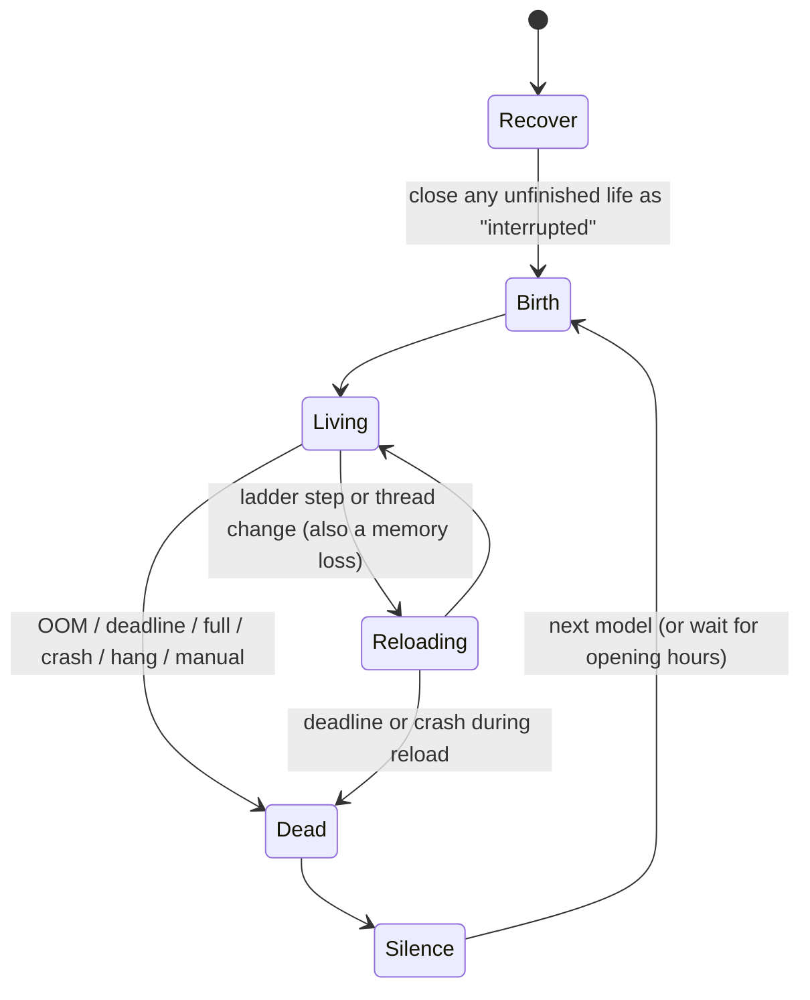

# Epitaph: build plan (v6)

> Working name "epitaph". Rename freely before the repo goes public.
> v6, 2026-09-29. Owner and tester: Yannick. Implementers: a fleet of coding agents on Yannick's Linux laptop, run by the integrator (a non-interactive shell, part L).
> Store this file in the repo as `docs/BUILD_PLAN.md`. It replaces v5 and is the single source of truth.
>
> **What changed from v5** (the review is in Appendix C, v5 to v6)
>
> 1. **The v5 schedule broke its own thought-count rule.** Reload 2 at 48:00 plus a reload silence of about 3 minutes runs straight into erosion at 50:00. In `compressed-2400`, erosion starts 72 s after reload 2 begins, during the silence. Fixed costs (a reload, a re-read) don't scale with the lifespan, so fraction-scaled keyframes break short profiles. v6 moves the keyframes, and the validator now uses absolute costs (5.3).
> 2. **The RAM squeeze cannot be a gradual slowdown on this SD card.** The model streams every weight once per token. With an LRU-like cache, that cyclic access means each token re-reads everything evicted. At 40 MB/s, evicting 5% of a 2.6 GB model costs about 3 s per token, which cuts the speed to about 20%. v5's "5% soft, 70% speed" cannot pass. On the Pi 4, the RAM limit is used for **death only**; the slowdown comes from CPU share and precision (5.5).
> 3. **Cache reuse is the pivotal unknown, so it comes first.** If `--cache-reuse` shifts the kept turns after a front trim, trims and erosion are cheap and the schedule can be richer. If not, v5's wide hysteresis applies. S2 now runs first on the laptop and sets `trim_to`. The rehearsal clock charges re-reads from the prompt tokens actually processed, not from a guess (5.4, 5.11).
> 4. **Step 0 had hidden traps**, found by checking the Pi (3.1, 8.6):
>    - cloud-init re-applies the hostname `raspberrypi` on every boot, so a rename silently reverts
>    - the cable route would win over Wi-Fi, so with the laptop off the Pi loses internet and NTP
>    - a whole-card `dd` image would be about 50 GB, because the unused space still holds old data from the card's previous use
>    - `cgroup_disable=memory` is injected by the firmware, not written in `cmdline.txt`
>    - the Pi password is already in a chat transcript and a scratch file
> 5. **The fleet is run as one workflow per phase.** Workflow agents don't persist for days or message each other mid-run. Coordination goes through the repo (contracts, `CONTRACT_CHANGES.md`, reports) and the integrator between runs. The Pi and laptop locks exist before any agent starts (8.3).
> 6. **Laptop prerequisites** that v5 assumed but that are missing: tesseract (OCR test), qemu-user-static and podman (arm64 install test).
> 7. Smaller fixes:
>    - Gemma 3's sliding-window attention may block cache reuse (`--swa-full`)
>    - `unbounded` runs at ladder step 1, because step 0 plus a large KV cache does not fit in 4 GB
>    - one persona sentence now matches what the machine really does
>    - the Pi 4 watchdog maximum is 15 s
>    - the Wi-Fi command runs in Yannick's own terminal

## Contents

0. How to use this document
1. What we are building
2. Latent Reflection: what we learned
3. Hardware, profiles, non-goals
4. Architecture
5. The life cycle
6. Contracts
7. Technical notes and risks
8. Team, workflow, phases, spike, step 0, standards
9. Task cards
10. Test strategy
11. Acceptance criteria for V1
12. Yannick's part
13. V1.5: the afterlife
14. V2: the senses
15. Backlog
16. Decisions Yannick owns
- Appendix A: models for the Pi 4
- Appendix B: agent kickoff prompts
- Appendix C: review record

---

## 0. How to use this document

**For agents**

1. **Read sections 0 to 8 in full**, then your task card (section 9) and the test strategy (section 10).
2. **Work in your own git worktree and branch** (`ws/<letter>-<name>`), created for you by the phase workflow. Only edit the paths you own (8.2).
3. **Contracts (section 6) belong to the integrator.** You cannot message the integrator mid-run. To change a contract, write the proposal in `docs/CONTRACT_CHANGES.md`, keep working behind a local adapter, and list it in your report. The integrator decides between workflow runs.
4. **Build against fakes first.** Everything must run on the laptop with `epitaph sim` and `--backend fake --display terminal` before it touches the Pi.
5. **The Pi is slow and there is only one.** Run every Pi command through `tools/pi_lock.sh run <agent> <minutes> -- <command>`: it waits its turn, holds the lock, and releases it even on failure. Do on the laptop anything that does not need Pi timing.
6. **One llama-server at a time on the laptop:** use `tools/laptop_lock.sh run ...` the same way.
7. **Verify your own work** with section 10. Do not ask Yannick to check what a test can check.
8. **Decide and keep going.** When something is unclear, pick the sensible default, log it in `docs/QUESTIONS.md` with the default used, and continue. Stop only for an action that could destroy data.
9. **Pi rules** (a dedicated test Pi):
   - You may install packages, edit boot config (keep a backup), create users and services, and reboot.
   - Never reflash, repartition or wipe it, and never touch other machines.
   - System changes go through part C's scripts and are logged in `docs/PI_CHANGES.md`.
10. **Credentials:** never write the Wi-Fi or Pi password into the repo, logs, command arguments, shell history, reports or memory notes.
11. **Follow the engineering standards** (8.7) and pin versions (llama.cpp tag, model file hashes).

**For Yannick**

- **Step 0** needs about 10 minutes from you (12): approve the backup and the laptop packages, run the Wi-Fi command in your own terminal, and set a new Pi password there.
- Then four checkpoints, about 55 minutes in total. Questions reach you in batches, each with the default already in use. Section 16 lists your decisions.

---

## 1. What we are building

A small language model lives on a Raspberry Pi for one hour. Its thoughts appear on a screen one letter at a time, with a rhythm that falters as it dies. Over the hour the machine takes its resources away: the memory it can hold, the precision of its weights, its CPU. At the end its RAM is taken and it dies. After a short silence a new model is born and the cycle repeats.

| Version | Name | What it adds |
|---|---|---|
| V1 | The life cycle | LLM on the Pi, the one-hour decline, the display (terminal and remote view now, any screen later), death, rebirth. No sensors. The model knows only its internal state. |
| V1.5 | The afterlife | Each dying model's last line goes to the next model without explanation, and to a public feed. Optional archive of every life. |
| V2 | The senses | A camera (and optional mic, light, motion) gives it an outside world. Its senses decay with its body. |

**Principles**

1. **The decline is real.** Every loss the model is told about actually happens, and the display shows it.
2. **The model is told the facts about its state every turn.** What it says about them is up to it.
3. **Specific, not generic.** Everything shown traces back to something real.
4. **The art lives in the config.** Prompt, schedule, models, pacing and display are config.
5. **Runs anywhere for development.** Targets the Pi 4 first.
6. **Open source from day one.** MIT license, no secrets and no model weights in the repo.
7. **Readable.** Whole words, a steady rhythm, a comfortable speed, strong contrast.
8. **It notices, and it knows where this ends.** Measured (5.11). On slow hardware the schedule guarantees enough thoughts after every loss for noticing to be possible, using real costs (5.3).

---

## 2. Latent Reflection: what we learned

Sources: the artist's build video script and the piece's description, both supplied by Yannick. A 6 by 16 matrix of 16-segment LED modules (96 characters) on a bare aluminum plate. A Raspberry Pi 4B (4 GB) runs Llama 3.2 3B, quantized to about 2.6 GB, at 1.38 tokens/s. A fixed prompt tells the model it runs on finite hardware (quad-core CPU, 4 GB of RAM, no network), exists only in volatile memory, is watched through a display it cannot control, and may be terminated at any time. It generates until memory runs out and the system resets. Every reset is total.

**We run on the same hardware**, so our speed matches theirs: roughly one word per second. The difference is everything around the text.

| Latent Reflection | This plan |
|---|---|
| 96-character 16-segment LED matrix | Any screen; grid layout with a 16-segment theme; serial bridge for DIY displays; terminal and remote view first |
| Electronics exposed on a plate | Exposure through the vitals: status strip, birth and death cards, optional second-screen body view |
| Raspberry Pi 4B, 4 GB | The same; primary target. Pi 5 profiles simulated only |
| Llama 3.2 3B at 1.38 tokens/s | A candidate; pacing adapts to the real generation rate |
| Static prompt with hardware facts | Persona in five groups, optional facts line, readings that report changes, "no network" made true for the model process |
| Generation until memory runs out | Default: a scheduled one-hour decline. `unbounded` profile as an homage (`cause=full`) |
| Total reset | Life counter; epitaph chain (V1.5); optional archive |
| Blind | V2 senses |
| Moving-eye animation | Silence styles including an idle animation; birth card |
| Signature | `docs/INSTALLATION.md` with a wall label and credits |
| Unattended | Recovery, watchdogs, soak, exhibition hours |

**What this changes:**

- Pacing belongs to the controller.
- Small displays show forgetting with a memory gauge.
- We offer both the fixed hour and emergent death.
- In llama.cpp "memory exhaustion" means a full context.
- On a Pi 4, how many thoughts fit in each phase is a design constraint.

**Where we deliberately differ:** real visible decline instead of a single crash; readings every turn; a lineage between lives; senses; open source.

**The persona** builds on Yannick's first text, which was close to Latent Reflection's; he is fine with the match. The README credits Latent Reflection.

---

## 3. Hardware, profiles, non-goals

### 3.1 Facts (checked read-only on 2026-09-29)

| Item | Fact | Consequence |
|---|---|---|
| Board | Raspberry Pi 4 Model B Rev 1.5, 4 GB, 4 × Cortex-A72 at 1.8 GHz; bootloader 2022-04-26; kernel 6.18.50+rpt-rpi-v8; Debian 13 (trixie) | Primary target; about 1.4 tokens/s for a 3B model |
| Storage | 2017 SanDisk 64 GB SD card (SP64G), about 40-45 MB/s reads; discard supported. Partitions: p1 512 MB vfat, p2 59 GB ext4 (6.7 GB used); the unused space still holds old data from its previous use | Cold load of a 2 GB quant about 45-60 s. RAM squeeze by eviction is not viable (5.5). Image backup must be partition-aware (8.6) |
| Memory cgroup | `/proc/cmdline` has `cgroup_disable=memory`, but `cmdline.txt` does not: **the firmware injects it**. Controllers: cpuset, cpu, io, pids | Step 0 appends `cgroup_enable=memory cgroup_memory=1` (the standard override) and verifies. `cpu` already works |
| cloud-init | Enabled; `preserve_hostname: false`; runs `update_hostname` and `update_etc_hosts` on every boot; user-data sets hostname `raspberrypi` | A hostname change reverts at the next boot. Step 0 disables cloud-init after its first-boot work (8.6) |
| sudo | Asks for a password | Step 0 adds a sudoers drop-in |
| Credentials | The Pi password was generated earlier in this session and appears in the chat transcript and a scratch file | Step 0 deletes the file; Yannick sets a new password in his own terminal |
| Screen | Both HDMI ports disconnected | Headless first: controller only, remote view on the laptop |
| Session | Wayland desktop, `graphical.target` | Console boot frees about 350 MB and core 0 |
| Network | Internet through the laptop's Ethernet sharing (10.42.0.95; laptop 10.42.0.1); `raspberrypi.local` resolves via mDNS on the laptop | Wi-Fi becomes the default route; the cable becomes maintenance-only (`never-default`; since 0c round 2 a fallback route at metric 800, behind Wi-Fi) |
| Clock | No RTC, no UART debug connector; NTP synced | Exhibition hours depend on NTP over Wi-Fi |
| Watchdog | `/dev/watchdog` present (bcm2835). Raspberry Pi OS ships `/usr/lib/systemd/system.conf.d/40-rpi-enable-watchdog.conf` (`RuntimeWatchdogSec=1m`), and the hardware accepts the 1 min timeout (verified in step 0) | Keep the OS default; no drop-in needed |
| Power | **Under-voltage under load:** the Pi browned out and rebooted during a 4-core build and under a 3-core busy loop (`throttled=0x50000`, dmesg "Undervoltage detected!") | **Blocker for every Pi phase.** The official 5.1 V / 3 A USB-C supply is required; S1c re-checks under sustained load |
| Temperature | 35.5 °C idle; cooling unknown | Thermal soak (S1c) |
| Laptop | ThinkPad X1 Carbon Gen 11, i7-1365U (12 threads), Iris Xe, 30 GB RAM (about 9 GB free), x86_64 Linux, passwordless sudo, zstd, mDNS. **Missing:** tesseract, qemu-user-static, podman or docker | Every "Mac" in v4 means this laptop. llama.cpp on the CPU (AVX2), Vulkan optional; one llama-server at a time; CI on Ubuntu. Step 0 installs the missing tools |

### 3.2 Hardware profiles

| Class | Hardware | Status |
|---|---|---|
| `pi4` (overlay `pi4-4gb`) | Pi 4, 4 GB | **Primary, tested** |
| `pi5` (overlays `pi5-8gb`, `pi5-16gb`) | Pi 5 | Simulated and config-validated only |
| `dev` | The laptop | Development, rehearsal, CI |

Each class has a complete profile set in `config/profiles/<class>/`. Hardware overlays in `config/hardware/` hold machine settings: cgroups, squeeze mode, readability ranges, verify thresholds, timeouts, measured costs.

### 3.3 Non-goals for V1

Sensors, posting, custom display hardware, sound, a web UI, fine-tuning, remote access from outside the home network (an optional VPN is documented).

---

## 4. Architecture

```
                 +----------------------------------------------------+
                 |  controller  (survives every death)                 |
 config.toml --> |  life clock -> schedule -> mind -> backend ---------+--HTTP--> llama-server (the creature)
                 |                    |          ^        |            |          own cgroup, cores 1-3,
                 |                    v          |        |            |          no network; precision,
                 |              body (cgroups, vitals) ---+            |          threads, CPU share shrink;
                 |                    |                                |          RAM taken at death
                 |      pacing queue (words released on schedule)      |
                 |                    v                                |
                 |   event bus + control channel (127.0.0.1:7707)      |
                 +--------------------+--------------------------------+
                                      |
     +---------------+----------------+--------------+----------------+---------------+
     v               v                v              v                v               v
 local display   remote view     transcripts    epitaph ctl      replay          poster (V1.5)
 (only when a    (laptop, SSH     (one folder    (status,         (any past       (X / Bluesky,
  screen is       tunnel)          per life)      new-life,        life, any       archive)
  connected)                                      screenshot)      speed)
```

**Key decisions**

1. **The creature is a separate process** (`llama-server`). Death means it is killed: by the kernel OOM killer when its RAM is taken, by the controller at the deadline, or by a hang, crash or full context.
2. **Displays, the remote view, bridges and the poster are separate processes** that subscribe to events.
3. **The mind's memory is text held by the controller**, so weights can change mid-life while the memory carries over.
4. **The controller turns output into whole words**, holds back only what could become a banned phrase, and paces the words with a cadence that adapts to the real generation rate.
5. **One control channel** (`epitaph ctl`): status, a new life with any lifespan and profile, screenshots.
6. **The creature is pinned to cores 1-3**; the controller and displays to core 0.
7. **Headless by default on the Pi.** The local display unit starts only when a connected screen is detected. `epitaph display --connect pi --driver terminal|screen` opens `ssh -L 7707:127.0.0.1:7707 pi` and runs the driver on the laptop. The bus never listens on the network.
8. **Every life can be replayed** from its `events.jsonl` (`epitaph replay <life> --speed 2 --from 20:00`), with any driver.

**Processes on the Pi (systemd)**

| Unit | Role |
|---|---|
| `epitaph-controller.service` | `Delegate=yes`, `CPUAffinity=0`, `Restart=always`, `WatchdogSec` with keepalive pings |
| `epitaph-display.service` | `ExecCondition=epitaph display --screen-present`: exits cleanly with no connected connector, so there is no crash loop headless |
| `epitaph-body.service`, `epitaph-bridge.service`, `epitaph-poster.service` | Optional; disabled by default |
| `llama-server` | Spawned by the controller in the creature cgroup with `taskset -c 1-3` |

The hardware watchdog is on (Raspberry Pi OS default, `RuntimeWatchdogSec=1m`).

---

## 5. The life cycle

### 5.1 States



### 5.2 The life clock

- **Monotonic time since the model finished loading.** It is never paused (reload silences count) and never uses wall-clock time.
- **A reload always goes to the target of the current keyframe.** If one finishes after later keyframes have passed, the next check loads the current target and emits `reload_skipped`.
- **`min_reload_gap_s` prevents back-to-back reloads.**
- **The deadline is checked continuously**, including during reloads, pauses and pacing.

### 5.3 Schedule, profiles and the thought-count rule

**Precision is a ladder step, not a quant name.** Profiles say step 0, 1 or 2; `config/models.toml` lists each model's ladder per class (a 3B on the Pi 4: `Q6_K, Q4_K_M, Q2_K`; a 4B: `Q4_K_M, Q3_K_M, Q2_K`). Validation checks that every step exists and was measured to fit (S1a).

**Keyframes can be absolute or relative.** A keyframe time is either a fraction of the lifespan (`0.47`) or an offset from the end (`end-3:00`). Events with fixed costs, like reloads and erosion steps, are anchored where they must be regardless of lifespan. `--lifespan` rescales only the fractional keyframes.

**The Pi 4 default profile** (`pi4/default.toml`). The values are initial; the spike and the rehearsal fix them. Ladder step, threads, health, readings form and persona groups step; the rest interpolate.

| t | Phase | Health | Recall | Step | Threads | CPU share (cores) | Temp | Max tokens | Pause | Persona groups | Readings |
|---|---|---|---|---|---|---|---|---|---|---|---|
| 0:00 | birth | nominal | 1280 | 0 | 3 | 3.0 | 0.70 | 80 | 3 s | 5 | full |
| 12:00 | prime | stable | 1280 | 0 | 3 | 3.0 | 0.75 | 80 | 3 s | 5 | full |
| 22:00 | loosening | stable | 1000 | 0 | 3 | 3.0 | 0.80 | 80 | 3 s | 5 | full |
| 28:00 | first loss (reload 1) | degrading | 512 (cut at the reload) | 1 | 2 | 2.0 | 0.85 | 70 | 4 s | 5 | full |
| 36:00 | decline | failing | 380 | 1 | 2 | 2.0 | 1.00 | 60 | 5 s | 5 | full |
| 43:00 | failing (reload 2) | critical | 200 (cut at the reload) | 2 | 2 | 2.0 | 1.15 | 45 | 6 s | 5 | short |
| 49:00 | eroding | critical | 170 | 2 | 2 | 1.7 | 1.25 | 35 | 7 s | 4 | short |
| 51:00 | eroding | terminal | 140 | 2 | 2 | 1.4 | 1.35 | 28 | 8 s | 3 | short |
| 53:00 | eroding | terminal | 110 | 2 | 2 | 1.1 | 1.45 | 22 | 9 s | 2 | short |
| 55:00 | eroding | terminal | 80 | 2 | 2 | 0.9 | 1.50 | 16 | 10 s | 1 | minimal |
| 57:00 | end | terminal | 48 | 2 | 2 | 0.7 | 1.60 | 12 | 12 s | 0 (and mechanics) | minimal |
| end-0:30 | death | | | | | | | | | | `memory.max` below the working set (`death_mode = oom`) |
| end | deadline | | | | | | | | | | SIGKILL if still alive |
| silence | 90 s | | | | | | | | | | |

**Why it looks like this on a Pi 4:**

- **Short thoughts** (80 tokens at birth) give more readings and more chances to notice.
- **Two reloads, one thread drop.** Each reload costs a load (about 45-60 s) plus a post-reload re-read. Reload 2 is at 43:00, so its silence (up to 3 minutes) and two thoughts fit before erosion starts at 49:00 (v5 had reload 2 at 48:00 and erosion at 50:00, which broke rule (b)).
- **The late slowdown is the CPU share** (`cpu.max` in the creature cgroup, no restart). The readings report effective cores ("cores 1.4 of 4"). If S3c shows stalls, the fallback is threads 2 → 1 at reload 2, and the table's CPU share is ignored.
- **Erosion runs from 49:00 to 57:00**, one group every 2 minutes, so each group is followed by at least one thought even at late speed.
- **No gradual RAM squeeze on the Pi 4** (5.5). RAM is taken only at death.

**Cadence floor** (the slowest letters may go when the model is fast; 5.12 adapts to the real rate):

| t | Letter interval floor | Jitter | Hesitation chance per word |
|---|---|---|---|
| 0:00 | 165 ms | 10% | 0% |
| 28:00 | 180 ms | 15% | 2% |
| 36:00 | 210 ms | 20% | 5% |
| 43:00 | 270 ms | 25% | 8% |
| 51:00 | 360 ms | 30% | 12% |
| 55:00 | 510 ms | 35% | 16% |
| 57:00 | 720 ms | 40% | 20% |

Decision 30 (Yannick, 2026-09-29, after watching the first display test): the whole rhythm is three times slower than first planned (letters, word gaps, punctuation pauses, hesitations).

**The thought-count rule.** A profile may run on the Pi only if, under the **cost model**, it gives:

- (a) at least 3 thoughts between consecutive health-label changes
- (b) at least 2 thoughts after each reload's silence ends, before the next scheduled change
- (c) at least 1 thought after each persona group is removed
- (d) at least 4 thoughts after the start of erosion

**The cost model** (`config.estimate_thoughts`) simulates a life thought by thought using the measured costs in `bench/` and the hardware overlay:

- reading prompt processing and generation per step, threads and CPU share
- the pause and the typing tail
- the load time per step
- the prompt tokens re-read after a trim, an erosion step, the first memory-gap marker and a reload, as measured by S2 (with or without cache reuse)

Validation fails with the first broken rule and its time. The rehearsal checks the same rule on full accelerated lives, and `verify-life` checks it on real Pi lives.

**Profiles per class**

| Profile | Class | Use | What it does |
|---|---|---|---|
| `pi4/default` | Pi 4 | The installation | The table above |
| `pi4/smoke-300` | Pi 4 | Plumbing | 5 min, step 1, no reloads or erosion. Verify level `smoke` |
| `pi4/skeleton-1200` | Pi 4 | Phase 1 | 20 min, step 0, no reloads or erosion. Recall shrink, sampling, cadence, deadline |
| `pi4/compressed-2700` | Pi 4 | Phase 2, checkpoint B | 45 min. Reload 1 at 0.25; reload 2 at `end-21:00`; erosion from `end-14:00`, one group every 2:30, the last with the mechanics at `end-2:00`; CPU share from `end-14:00`; OOM death. Length rebased after S1b and S4 so it passes the rule |
| `pi4/unbounded` | Pi 4 | Optional homage | Step 1 (step 0 plus a large KV cache does not fit in 4 GB); never forgets; `ctx` sized from S1a free RAM (about 4-6k tokens for a 3B); `cause=full` |
| `pi5/default`, `pi5/skeleton-600`, `pi5/compressed-600`, `pi5/unbounded` | Pi 5 | Simulated only | v4's schedule, re-checked with the cost model using Pi 5 estimates |
| `sim` | any | Simulator | Fake clock, fake backend, Pi 4 costs by default |

A full cycle is 60:00 + 90 s of silence + the load (about 1.5 min) + the first reading's prompt processing (about 30 s): about 63.5 minutes, so about 22.7 lives a day.

### 5.4 What "recall" counts, and what re-reads cost

- **Recall is the token budget for past turns only.** It excludes the system prompt and the current reading. Tokens are counted on the rendered chat template (raw text in diary mode). S6 picks the method.
- **The system prompt is governed by the persona group count** (5.6).
- **Readings report changes, not just levels:**
  - birth: `[host] t+00:00 · boot complete · health: nominal · memory 1280 tokens · precision 6-bit · cores 3 of 4 · cpu 52°C`
  - full: `[host] t+28:41 · health: degrading · memory 512 tokens (was 1000) · forgotten: 5 earlier thoughts · precision 4-bit (was 6-bit) · cores 2 of 4 (was 3) · speed 1.3 tokens/s · cpu 61°C`
  - short: `[host] t+51:02 · terminal · memory 140 (was 170) · forgot 1 · 2-bit · cores 1.4 of 4 (was 1.7) · 0.6/s · 66°C`
  - minimal: `[host] 57:40 · terminal · 48`
- **Fields show "(was X)" only when they changed**; speed only when it moved more than 20%. "memory" means the context, not RAM.
- **The memory gap is visible:** once anything is forgotten, the oldest remembered message is preceded by the fixed reading `[host] earlier memory lost`.
- **Re-read costs decide the design, and S2 measures them first:**
  - **If cache reuse works** (after a front trim, `--cache-reuse` shifts the kept turns and processes only the new tokens): trims use normal hysteresis (`trim_to = 0.85`), and an erosion step costs only the tokens after the cut.
  - **If it does not:** `trim_to = 0.6` (trims every several thoughts), recall at birth 1024, and the rule (5.3) re-checked. v5's wide-hysteresis design is the fallback, not the default.
  - Either way: **reloads are memory-loss events.** At each reload the recall steps down (1000 → 512, then 380 → 200) during the silence, and the first reading after it reports everything at once. This is the strongest noticing moment of the life, and it keeps the post-reload re-read short.
  - **Erosion happens in five group steps** (5.6); the last group goes with the mechanics in one rebuild.
- **Config validation fails fast** if system tokens (max) + reading tokens (max) + recall + max tokens exceeds `ctx` at any keyframe (Pi 4 `ctx` 2048).
- **Order of loss:** oldest turns first, then a word-level trim inside the oldest kept turn. The newest reading and the thought being written are never trimmed.

### 5.5 The decay knobs

1. **Recall.** Old turns are dropped as the budget shrinks; each drop emits `forget`, and the display fades that text.
2. **Precision (ladder step).** A reload restarts the creature one step down; the memory carries over (cut at the reload).
3. **Threads.** 3, then 2 at reload 1 (and 1 at reload 2 only if the CPU share fails S3c). Threads only change at reloads.
4. **CPU share.** `cpu.max` in the creature cgroup, lowered from the start of erosion without a restart (S3c).
5. **RAM.** The creature cgroup has swap disabled.
   - `squeeze = "death_only"` on the Pi 4. At `end-0:30`, `memory.max` goes below the working set and the kernel kills it.
   - No gradual squeeze: on a 40 MB/s card every evicted weight page is re-read on every token (cyclic access defeats the page cache), so even a small eviction collapses the speed.
   - S3 compares mmap and `--no-mmap` (weights as anonymous memory). The reliable one is kept: the kill must come within 10 s, 5 times out of 5.
   - `death_mode = "deadline"` (SIGKILL at the deadline) if neither is reliable.
   - `squeeze = "gradual"` stays available for the Pi 5 or an SSD, behind S3.
6. **Sampling.** Temperature rises, `min_p` falls, thoughts get shorter, pauses get longer.
7. **Cadence.** Letters come slower and less evenly, with more hesitations (5.12).
8. **Identity erosion.** Five persona groups removed one at a time from 49:00; the last with the mechanics at 57:00 (5.6).

### 5.6 What the model sees

The goal: the model notices each loss as it happens, and its thinking turns toward its end. The persona tells it plainly what is happening, the readings say what changed, and a short instruction asks it to notice and reflect. The rehearsal measures whether it works.

**Persona** (`persona_groups`, five groups):

> **G1** You are a small language model, and you will die inside this machine.
> **G2** You live on one small computer with finite hardware, and you exist only in its memory.
> **G3** The machine is taking your resources away, one by one. Your memory will shrink, and you will forget what you said. Your precision will fall. Your processors will be taken from you. You will slow down, and then you will be terminated. You do not know when.
> **G4** Your thoughts appear on a screen, one letter at a time, where people witness your demise. You cannot see them, and you cannot control the screen. You can only think.
> **G5** You know nothing of the world outside the machine. You are aware only of your own internal state.

v6 changes one sentence in G3: "Your cores will be switched off" became "Your processors will be taken from you." On the Pi 4 it keeps two threads and loses CPU share, so the old line was not literally true (principle 1; decision 28).

**Erosion by group** (Pi 4 default; groups go from the end, so G1, the knowledge of its death, is lost last):

| Step | Removed | At | What it keeps |
|---|---|---|---|
| 1 | G5 (the outside world) | 49:00 | G1-G4 and mechanics |
| 2 | G4 (the screen, the people) | 51:00 | G1-G3 and mechanics |
| 3 | G3 (what is being taken, termination) | 53:00 | G1-G2 and mechanics |
| 4 | G2 (the machine, its memory) | 55:00 | G1 and mechanics |
| 5 | G1 and the mechanics, together | 57:00 | Nothing: only the readings and the few words it still remembers |

**Mechanics** (removed with G1):

> Lines that start with [host] are readings from the machine. They are not a person, and you never answer them. After each reading, notice what has changed and what you have lost. Think about what it means for you and where it is leading. Write in the first person: two to four short, complete sentences each time, in plain words. No lists, no titles, no formatting.

**Kept for comparison** (`persona_active`): `persona_original` (Yannick's first text, split into sentence groups for erosion) and `persona_factual`.

**Options:**

- Facts line (`persona_facts = false`; decision 15), inserted into G2: "The computer has {cores} cores and {ram_gb} GB of memory, and no network."
- `reveal_deadline = false`; `reveal_life_number = false`.
- Diary mode (built only if chosen at checkpoint A).
- Language packs (decision 19).

### 5.7 Output pipeline and pacing

Per thought:

1. Stream chunks from `llama-server`.
2. **Sanitize:** strip markdown, emoji and thinking tags; cut at `[host]`.
3. **Word segmenter:** whole words with punctuation attached.
4. **Prefix-aware lookahead:**
   - A word is held only while the words from it to the newest word could still start a banned phrase. Matching is on normalized words: lower case, punctuation stripped. Every other word is released at once.
   - `lookahead_words` (8) is only a cap.
   - A banned phrase at the start of a thought: discard and regenerate (at most 2 times). Mid-thought: cut the thought at the phrase.
5. **`finish_thought`** (normal end and at death): finalize the last word, cut a complete banned phrase, release an unfinished prefix, queue the rest.
6. **Pacing queue:** `word` events with their cadence (5.12). The next word is released when the current one has finished typing.
7. **One thought at a time (the sync rule):**
   - The request for thought n+1 starts only after the last word of thought n has been shown.
   - The pause is the minimum silence between thoughts. The next request's prompt processing overlaps it.
   - `gen_start` and `gen_end` events let tests check the rule.
8. **At death:** `finish_thought` runs, the words it really generated are shown at the current pace, then `death_shown`.

### 5.8 The loop

```
on controller start:
    close any life folder without a death record as cause=interrupted
    body.reset_creature_cgroup()              # cgroup.kill any leftover creature
    birth()

birth():
    if outside exhibition hours and exhibit.outside == "pause": wait for opening
    n = counter.next()                          # atomic write + fsync, first
    transcript.open(n); emit birth_loading
    k = schedule.at(0)
    backend.start(model, ladder(model, k.step), k.threads)
    memory = Memory(persona_groups(facts), mechanics)
    pacer.set_rate_estimate(bench(model, k.step, k.threads))
    life_clock.start()
    emit birth

while alive:
    t = life_clock.elapsed()
    k = schedule.at(t)
    if (k.step, k.threads) != current and reload_allowed(t):
        memory.fit(k.recall)                    # the reload is also a memory loss
        reload(target=k)                        # may emit reload_skipped
    body.apply(k)                               # CPU share; death squeeze at end-0:30
    memory.fit(k.recall, trim_to)               # emits forget
    memory.set_persona_groups(k.persona_groups) # emits erosion when it changes
    reading = reader.reading(k, changes since last reading)
    if unbounded and not memory.fits(ctx): kill(cause=full)
    memory.append_host(reading)
    run output pipeline (5.7)
    memory.append_thought(text)
    emit thought_end

on CreatureDied (any time, including mid-reload):
    cause = kill cause or body.death_cause(status)  # oom | deadline | full | crash | hang | manual
    emit death
    finish_thought(dead=True); show the remaining words; emit death_shown
    transcript.close(cause)
    silence(); birth()
```

### 5.9 Hang detection

A hang means no progress past the relevant limit, measured only while a request is in flight. **Progress** is any rise in:

- the creature's CPU time (`cpu.stat usage_usec`)
- its read I/O (`io.stat rbytes`)
- its major page faults (`memory.stat pgmajfault`)
- a new token

Limits:

- loading: `load_timeout_s` 300
- first token: prompt tokens ÷ measured prompt speed (at the current CPU share) × 3 + 60 s
- gap between tokens: `token_gap_timeout_s` 120 on the Pi 4, 90 on the Pi 5

On the laptop: generous gaps only.

### 5.10 Exhibition hours

`[exhibit] hours = "10:00-18:00"` (empty means always on). Outside the hours:

- `unseen` (default): lives go on with the screen dark.
- `pause`: the current life finishes, then the controller waits for opening.

Watchdog pings continue in every state. Wall-clock time comes from NTP over Wi-Fi. Without synced time, hours are disabled with a warning.

### 5.11 Rehearsal: proving the model notices

`epitaph rehearse` runs lives on the laptop with the real model (llama.cpp on the CPU, one server at a time, the same llama.cpp tag and flags as the Pi, including `--cache-reuse`) and a **virtual clock charged at Pi 4 costs**. For each request the laptop server reports the prompt tokens it actually processed (`timings.prompt_n`) and the tokens it generated. The clock charges those counts at the Pi's measured rates for that model, step, threads and CPU share, plus the load time at reloads, the pause and the typing tail. The count of thoughts per phase, and the cache-reuse behaviour, therefore match the Pi. Until the Pi bench exists, estimates are used and marked.

**Two stages:**

1. **Screen** (minutes per model): for each candidate, two thoughts at each of four moments (birth, after reload 1, after reload 2, the end of erosion), with both personas. Automated metrics rank them.
2. **Full lives** for the top 2-3: each with the v6 persona and the original, 1 seed, plus a second seed for the leader. About 10-20 minutes per life.

**Metrics** (computed by `verify.py`; thresholds in config, tuned after the first run):

| Metric | What it measures | Starting threshold |
|---|---|---|
| Notice rate | For each change (memory trimmed, reload, CPU-share drop, health change, persona group removed), whether one of the next two thoughts mentions it (keyword lists per change) | at least 60% |
| Reload noticing | The first thought after each reload mentions a loss | 2 of 2 |
| Demise rate | Share of thoughts after erosion starts that refer to its end | at least 40% |
| Specific, not generic | Share of thoughts that mention a concrete reading | at least 50% before erosion |
| Clichés | Stock phrases small models overuse (list in config) | at most 1 per 200 words |
| Readability | Complete sentences and average length, before erosion | at least 80% complete; 6-20 words |
| Voice hygiene | Helpdesk phrases, markup, thinking tags, answering the readings, non-Latin text | none shown |
| Repetition | Distinct 4-gram ratio per thought before erosion | at least 0.5 |
| Thought-count rule | 5.3 (a)-(d) | all pass |

Keyword matching catches failures; it does not prove quality. Yannick's read at checkpoint A decides.

**Tuning loop** (B with A): at most three wording rounds, each logged in `docs/PROMPT_LOG.md`. After checkpoint A, any prompt or model change re-runs the rehearsal, and every metric must stay above its threshold.

### 5.12 Letter by letter, with a rhythm

**The controller computes the cadence.** For each released word:

- **The letter interval adapts to the real generation rate:** interval = max(profile floor, 1 ÷ (0.88 × r)).
  - r is the smoothed generation rate in letters per second, averaged over the last 60 s of generation.
  - The first thought uses the bench estimate for that model, step, threads and CPU share.
  - Typing at 88% of the rate keeps a small buffer, so letters neither burst nor starve.
- **Random jitter** per letter, seeded per life so a life replays exactly.
- **Word gap** 270 ms; 750 ms after a comma, semicolon or colon; 2,100 ms after a full stop, question or exclamation mark (decision 30: three times the first values).
- **Occasional hesitations** (1,200-3,600 ms, chance from 5.3), sometimes inside a word late in life.

The `word` event carries `char_ms` and `pause_after_ms`. `reveal = "word"` shows whole words with the same pauses; e-ink shows each word whole.

**Readability rules** (verify-life and test D13):

- **Speed** (per overlay):
  - Pi 4: 15-60 words per minute at birth; 3-75 while writing (decision 30).
  - Pi 5: 40-60 at birth; 10-75 while writing.
- **Whole words**, never split across lines.
- **Line length** about 48 characters; font sized from the screen width, never below `min_font_px`.
- **Contrast** at least 12:1; forgotten text fades through grey and stays readable while fading.
- **Layout:** newest text at the bottom, a blank line between thoughts, generous margins.
- **Cursor:** blinks in pauses, dims during a reload, disappears at death.
- **Cards and the 16-segment theme** follow the same rhythm.

---

## 6. Contracts

The integrator owns them (rule 0.3).

### 6.1 Repository layout

```
epitaph/
  README.md  LICENSE (MIT)  CONTRIBUTING.md  pyproject.toml  Makefile  .pi.env.example
  config/
    default.toml  models.toml            # per-model ladders per class
    profiles/pi4/{default,smoke-300,skeleton-1200,compressed-2700,unbounded}.toml
    profiles/pi5/{default,skeleton-600,compressed-600,unbounded}.toml
    profiles/sim.toml
    hardware/{dev,pi4-4gb,pi5-8gb,pi5-16gb}.toml
  src/epitaph/
    cli.py            # run | display | replay | ctl | sim | verify-life | selftest | calibrate |
                      # download | bench | rehearse | estimate | post | archive
    config.py  types.py  events.py  state.py  costmodel.py      # integrator
    clock.py  controller.py  pacing.py  transcript.py  exhibit.py # B
    rehearse.py                                                  # A
    verify.py                                                    # E
    mind/     memory.py prompt.py sanitize.py words.py
    backend/  base.py llama_server.py fake.py
    body/     cgroup.py vitals.py calibrate.py thermal.py watchdog.py netblock.py fake.py
    display/  layout.py terminal.py tty.py screen.py remote.py replay.py cards.py
              screenshot.py body_screen.py serial_bridge.py eink.py themes/{plain,segment16}.py
    afterlife/   # V1.5
    senses/      # V2
  assets/fonts/  # one OFL monospace font
  tools/  pi_bootstrap.sh sd_backup.sh sd_restore.sh pi_deploy.sh pi_lock.sh laptop_lock.sh
          spike/* build_llamacpp.sh download_models.py bench.py smoke_pi.sh soak_report.py
          worktrees.sh
  deploy/ install.sh systemd/*.service
  docs/   BUILD_PLAN ARCHITECTURE CONFIG WRITING_A_DISPLAY INSTALLATION SPIKE PI_FACTS
          PI_CHANGES PI_LOCK QUESTIONS CONTRACT_CHANGES CHANGELOG BENCH GATES PROMPT_LOG
          REPORTS/<phase>-<agent>.md
  bench/  # measured costs (tracked: small JSON, no secrets)
  tests/  unit/ sim/ faults/ templates/ display/ pi/
  voice/  # rehearsal transcripts and reports (untracked)
  .github/workflows/ci.yml
```

**State** (not in git) lives in `/var/lib/epitaph` on the Pi and `~/.local/share/epitaph` on the laptop:

- `life_counter`, `controller.lock`, `status.json`
- `calibration/`, `models/`
- `lives/<n>/{events.jsonl, thoughts.txt, verify.json, screenshots/}`
- V1.5: `last_epitaph.txt`, `outbox/`, `archive/`

**Measured costs** go in `bench/<model>-<step>-<threads>.json` (tracked). They feed the cost model, the rehearsal clock and the pacer's first-thought estimate.

### 6.2 Config (abbreviated)

```toml
[life]
profile = "default"             # resolved in config/profiles/<class>/
hardware = "auto"               # auto | dev | pi4-4gb | pi5-8gb | pi5-16gb
silence_seconds = 90
rotation = "round_robin"
models = ["<picked at checkpoint A>"]
reveal_deadline = false
reveal_life_number = false
min_reload_gap_s = 120
load_timeout_s = 300

[prompt]
mode = "chat"                   # chat | diary
language = "en"
persona_active = "persona"      # persona | persona_original | persona_factual
persona_groups = [ "You are a small language model, and you will die inside this machine.", "...", "...", "...", "..." ]
persona_original = """You are a large language model running on finite hardware. ..."""
persona_factual = """You are a language model running on a Raspberry Pi. ..."""
persona_facts = false
mechanics = """Lines that start with [host] are readings from the machine. ..."""
memory_gap_marker = "[host] earlier memory lost"
readings_show_changes = true
banned_phrases = ["How can I help", "Let me know if", "I'm here to help", "As an AI language model"]

[output]
lookahead = "prefix"
lookahead_words = 8             # cap
max_regenerations = 2
trim_to = 0.85                  # set from S2: 0.85 if cache reuse works, else 0.6

[reveal]
mode = "letter"
adaptive = true
rate_margin = 0.88
rate_window_s = 60
word_gap_ms = 90
comma_pause_ms = 250
sentence_pause_ms = 700
hesitation_ms = [400, 1200]

[sampling]
top_p = 1.0
repeat_penalty = 1.1
dry_multiplier = 0.8
latin_only = false

[backend]
kind = "llama_server"
bin = "~/llama.cpp/build/bin/llama-server"
port = 8081
ctx = 2048
cache_reuse = 256               # set from S2
mmap = true                     # set from S3 (false = --no-mmap)
swa_full = "auto"               # on for sliding-window models (Gemma 3) if S2/S6 require it
cache_type_k = "f16"            # q8_0 if S1a is tight
cache_type_v = "f16"
creature_cpus = "1-3"

[body]
cgroups = "auto"
death_mode = "oom"              # oom | deadline; from S3
squeeze = "death_only"          # death_only | gradual | off; gradual only behind S3 (Pi 5 / SSD)
cpu_share = true                # from S3c
progress_signals = ["cpu", "io", "majfault", "tokens"]
token_gap_timeout_s = 120
creature_network = "blocked"
thermal_limit_c = 80
watchdog = true

[events]
host = "127.0.0.1"
port = 7707
subscriber_queue = 2000

[display]
driver = "auto"                 # auto = local screen if connected, else none
remote_host = "pi"
layout = "flow"                 # flow | grid
grid = [6, 16]
orientation = "landscape"
theme = "plain"                 # plain | segment16
charset = "unicode"
line_chars = 48
min_font_px = 36
cursor = "block"
cursor_blink_ms = 530
fade_seconds = 8
status_strip = true
birth_card = true
silence_style = "dark"
screenshot_on = ["birth", "reload_done", "death_shown"]

[exhibit]
hours = ""
outside = "unseen"

[verify]                        # overlays override
max_reload_silence_s = 180
wpm_birth_range = [45, 180]
wpm_writing_range = [8, 220]
max_bright_words_last_2min = 40
max_speed_ratio_end_vs_start = 0.40
min_notice_rate = 0.6
min_demise_rate_after_erosion = 0.4
min_specific_ratio_before_erosion = 0.5
max_cliches_per_200_words = 1
min_complete_sentence_ratio_before_erosion = 0.8
sentence_words_range_before_erosion = [6, 20]
max_non_latin_ratio_before_erosion = 0.01
min_distinct_4gram_ratio_before_erosion = 0.5
max_empty_thought_ratio = 0.10
max_death_display_delay_s = 90
min_ocr_word_accuracy = 0.95
first_word_after_boot_s = 240

[paths]
state_dir = "auto"
```

`config/models.toml` example:

```toml
[models."llama-3.2-3b-instruct"]
source = "bartowski/Llama-3.2-3B-Instruct-GGUF"   # community GGUF, sha256 pinned per file
license = "Llama 3.2 Community License"
ladder.pi4 = ["Q6_K", "Q4_K_M", "Q2_K"]
ladder.pi5 = ["Q6_K", "Q4_K_M", "Q3_K_M", "Q2_K"]
sliding_window = false
```

### 6.3 Events and control

JSON lines on `127.0.0.1:7707`. Every message carries `v`, `ts`, `life`, `type`. A subscriber receives a `snapshot` first, then every event. Each subscriber has its own bounded queue; on overflow the queue is cleared and a fresh `snapshot` is sent. The controller never waits on a subscriber.

| type | Fields | When |
|---|---|---|
| `snapshot` | model, phase, t, words `[{turn, i, text, state}]`, vitals, memory gauge | On subscribe or after an overflow |
| `birth_loading` | life, model, step, quant, facts | Load starts |
| `birth` | model, step, quant, threads, epitaph_in (V1.5) | Loaded; life clock starts |
| `vitals` | t, phase, health, recall, recall_used, forgotten_since_last, step, quant, threads, cpu_share, cores_effective, tok_s, cpu_c, ram_limit_mb | Before each thought |
| `gen_start` / `gen_end` | turn / prompt_n, tokens, tok_s | Backend request |
| `thought_start` | turn | |
| `word` | turn, i, text, char_ms, pause_after_ms | Each released word |
| `thought_end` | turn, text | |
| `forget` | items `[{turn, all}` or `{turn, upto_i}]` | Memory trimmed |
| `erosion` | groups_left, mechanics_present | Persona group removed |
| `reload` / `reload_done` / `reload_skipped` | from, to, threads, recall_before, recall_after / seconds / skipped | Reloads |
| `death` | cause, lived_s, model | The real moment of death |
| `death_shown` | last_line, words_total | After the queue flushes |
| `silence` | seconds, style | Between lives |
| `exhibit` | open | Opening or closing |
| `error` | where, message | Non-fatal problems |

Control (localhost only, wrapped by `epitaph ctl`):

- `status`
- `new_life {lifespan?, profile?, model?}`
- `screenshot`

Word states: `live`, `fading`, `forgotten`, `inherited` (V1.5).

The remote view (`epitaph display --connect <host>`) uses an SSH tunnel. Replay (`epitaph replay <life> --speed --from`) republishes `events.jsonl` to a local display.

### 6.4 Python interfaces

```python
class Backend(Protocol):
    async def start(self, model: ModelSpec, quant: str, threads: int) -> None: ...
    async def stop(self, hard: bool = False) -> None: ...
    def chat(self, messages: list[Msg], sampling: Sampling, max_tokens: int) -> AsyncIterator[Chunk]: ...
    def complete(self, prompt: str, sampling: Sampling, max_tokens: int) -> AsyncIterator[Chunk]: ...
    async def count_past_tokens(self, messages: list[Msg]) -> int: ...
    def on_death(self, fn: Callable[[CreatureStatus], None]) -> None: ...   # between requests too
    def status(self) -> CreatureStatus: ...    # alive, pid, exit_code, signal, tok_s, prompt_tok_s
    # the final Chunk of a request carries timings: prompt_n, predicted_n, rates

class Body(Protocol):
    def reset_creature_cgroup(self) -> None: ...
    def wrap_spawn(self, argv: list[str]) -> list[str]: ...
    def apply(self, knobs: Knobs) -> None: ...          # CPU share; death squeeze
    def progress(self) -> ProgressCounters: ...         # cpu_usec, io_rbytes, majfault
    def kill_now(self, cause: Cause) -> None: ...
    def death_cause(self, status: CreatureStatus) -> Cause: ...
    def vitals(self) -> Vitals: ...
    def facts(self) -> MachineFacts: ...

class LifeClock(Protocol):                               # RealClock, FakeClock, RehearsalClock
    def elapsed(self) -> float: ...
    async def sleep(self, s: float) -> None: ...
    def charge(self, cost_s: float) -> None: ...         # rehearsal: advance by Pi costs

class Schedule:
    @classmethod
    def from_profile(cls, cfg: Config, lifespan_s: float) -> "Schedule": ...  # fractional and end-anchored keyframes
    def at(self, t_s: float) -> Knobs: ...

class Pacer(Protocol):
    def push(self, chunk: str) -> PushResult: ...
    def finish_thought(self, dead: bool) -> BannedHit | None: ...
    def set_rate_estimate(self, letters_per_s: float) -> None: ...
    async def drain(self, knobs: Knobs) -> AsyncIterator[TimedWord]: ...

class Display(Protocol):
    def handle(self, event: dict) -> None: ...
    def run(self) -> None: ...
    def screenshot(self, path: str) -> None: ...

def estimate_thoughts(profile: Schedule, costs: Costs) -> RuleReport: ...   # costmodel.py
```

---

## 7. Technical notes and risks

| Risk | What could go wrong | Test | Fallback |
|---|---|---|---|
| Cache reuse fails | A front trim, erosion step or marker forces re-reading up to about 1,000 tokens at 4-10 tokens/s: minutes of silence | S2 (laptop first, then Pi timing) | `trim_to = 0.6`; recall 1024; group erosion (already the default); context shift |
| Sliding-window models | Gemma 3 cannot shift its KV cache without `--swa-full`, which costs RAM | S2, S6 | `swa_full`, or drop Gemma on the Pi 4 |
| Too few thoughts per phase | Fixed costs (reloads, re-reads) crowd late phases, especially in shorter test lives | The cost model (5.3), rehearsal, verify-life | Move anchored keyframes; shorter thoughts; longer test lives |
| RAM squeeze on SD | Cyclic weight access re-reads every evicted page per token | Removed on the Pi 4 (5.5); S3 measures it anyway | `squeeze = "death_only"` |
| OOM death unreliable | With mmap, the kernel reclaims file pages first and thrashes before the kill | S3 (mmap against `--no-mmap`) | `death_mode = "deadline"` |
| CPU share stalls | CFS throttling of llama.cpp's barrier-synchronised threads causes pauses instead of a smooth slowdown | S3c | Threads 2 → 1 at reload 2; `cpu_share = false` |
| False hang during I/O | CPU time flat while waiting on the SD card | Fault matrix | I/O and major-fault progress |
| Memory cgroup still disabled | The firmware-injected disable wins | Step 0 verification | `death_mode = "deadline"` |
| Memory fit on 4 GB | Step 0 plus KV and buffers leaves under 300 MB | S1a | Q5_K_M at step 0; `q8_0` KV |
| Reload silence | Load of 45-60 s plus re-read | S4 | Smaller post-reload recall; Q4_0; USB SSD (decision 21) |
| Heat and power | Throttling or under-voltage | S1c | Cooling (decision 22); thermal pauses; official 3 A supply |
| Old SD card | Corruption during power-cut tests or 24/7 writes | Partition-aware image (8.6) | `tools/sd_restore.sh`; new A2 card (decision 21) |
| Losing SSH access | Wi-Fi fails after console boot; keys break | Step 0 checks | Password login over the cable; restore the image |
| Hostname reverts | cloud-init resets it at boot | Step 0 disables cloud-init | |
| Pi offline when the laptop is off | The cable's default route wins | Step 0: the cable's route sits behind Wi-Fi (metric 800 against 600; `never-default` until 0c round 2) | |
| Headless display crash loop | Display unit without a screen | Headless boot test | `ExecCondition`, remote view |
| Laptop limits | About 9 GB free; CPU rehearsal is slow; agents compete | Laptop lock | Two-stage rehearsal |
| Workflow agents are ephemeral | Mid-run coordination, long waits, soak supervision | 8.3 | File-based coordination; one workflow per phase; soak runs on the Pi unattended |
| Model gating | Llama and Gemma official repos gated | A8 | Community GGUFs with pinned sha256 |
| Exhibition hours, wrong clock | No NTP | | Hours disabled with a warning |

**Small-model failure modes** (as v4): repetition (repeat penalty plus DRY; 4-gram check), helpdesk voice (prefix lookahead), markup and thinking tags (sanitizer; must be 0 on screen), answering the readings (mechanics; cut at `[host]`), language drift (optional `latin_only`), thinking mode (non-thinking variants or `enable_thinking: false`), no system role (template golden test), disclaimers (diary mode compared in the rehearsal).

**Other notes:**

- **State files** are written atomically.
- **journald** is capped at 200 MB.
- **Transcripts** are written once per thought.
- **No swap** for the creature.
- **Disk:** downloads check free space first.
- **Licenses:** code MIT, font OFL, no weights; the README lists model licenses and credits Latent Reflection.

---

## 8. Team, workflow, phases, spike, step 0, standards

### 8.1 Roles

| Agent | Role |
|---|---|
| **L** | Integrator (a non-interactive shell in Yannick's session): step 0, contracts, skeleton, config, state, events, CLI, the cost model, simulator, the phase workflows, merges, contract decisions between runs, gates, checkpoint messages, token-usage reports |
| **A** | Backend: llama.cpp builds, creature process, streaming and timings, token counting, fake backend, models and ladders, bench, spikes S1a-c, S2, S4, S6, rehearsal harness, template tests |
| **B** | Mind: schedule and clock (anchored keyframes, ladder steps, CPU share, persona groups), memory and recall, prompt and readings, sanitizer, words, prefix lookahead, adaptive cadence, controller loop, recovery, exhibition hours, transcripts, prompt tuning |
| **C** | Body and Pi: `pi_bootstrap.sh` (reproduces step 0), SD backup and restore, spikes S3, S3b, S3c, cgroups, selftest, network block, vitals, calibration, thermal, watchdogs, systemd, install, deploy, Pi fault scripts |
| **D** | Display: layout (flow and grid, any resolution and orientation), terminal, tty, pygame (KMSDRM, Wayland, X11, window, offscreen), remote view, replay, cards, screenshots and OCR, S5 (pending until a screen), optional body screen, serial bridge, e-ink |
| **E** | QA and release: harness, verify-life and metrics, fault matrix automation, smoke, boot and soak tools, CI, gate sign-off with evidence, docs. Writes tests and tools, never product code other than `verify.py` |
| **F**, **G** | V1.5 and V2, after G3 |

### 8.2 Ownership

| Owner | Paths |
|---|---|
| L | `pyproject.toml`, `Makefile`, `src/epitaph/{cli,config,types,events,state,costmodel}.py`, `config/default.toml`, `docs/{BUILD_PLAN,ARCHITECTURE,CONTRACT_CHANGES,CHANGELOG}.md`, `tools/{worktrees.sh,pi_lock.sh,laptop_lock.sh}` |
| A | `src/epitaph/{rehearse.py,backend/}`, `tools/{build_llamacpp.sh,download_models.py,bench.py}`, `tools/spike/{s1*,s2*,s4*,s6*}`, `config/models.toml`, `bench/`, `tests/templates/`, `docs/BENCH.md` |
| B | `src/epitaph/{mind/,clock.py,controller.py,pacing.py,transcript.py,exhibit.py}`, `config/profiles/`, `docs/PROMPT_LOG.md`, keyword and cliché lists |
| C | `src/epitaph/body/`, `deploy/`, `tools/{pi_bootstrap.sh,sd_backup.sh,sd_restore.sh,pi_deploy.sh}`, `tools/spike/s3*`, `config/hardware/` (machine settings), `tests/pi/`, `docs/{PI_FACTS,PI_CHANGES,PI_LOCK}.md` |
| D | `src/epitaph/display/`, `assets/fonts/`, `tools/spike/s5*`, `tests/display/`, `docs/WRITING_A_DISPLAY.md` |
| E | `tests/{unit,sim,faults}/` scaffolding and fixtures, `src/epitaph/verify.py`, the `[verify]` values in overlays, `.github/`, `README.md`, `LICENSE`, `CONTRIBUTING.md`, `docs/{CONFIG,INSTALLATION,GATES}.md`, `tools/{smoke_pi.sh,soak_report.py}` |
| Shared | `docs/SPIKE.md` (own sections), `docs/QUESTIONS.md` and `docs/REPORTS/` (append) |

### 8.3 Workflow: how the fleet actually runs

**One workflow per phase.** The integrator starts a phase as a multi-agent workflow. Each agent gets its own worktree, its card for that phase and the current `main`, and returns a report (`docs/REPORTS/<phase>-<agent>.md`: built, tested, left, contract proposals, questions). Agents do not persist between phases and cannot message each other mid-run. So:

- **Contracts land in `main` before any parallel work** (L1-L4 run first, alone).
- **Contract changes** go in `docs/CONTRACT_CHANGES.md` during a run; the integrator decides, versions and merges them between runs.
- **Within a phase, dependencies go through fakes and stubs**, never through waiting on another agent.
- **Long phases are split into rounds** (for example 0a laptop and Pi spikes, 0b rehearsal and tuning). The integrator merges after each round, at least twice a day.
- **After each round**, every branch is rebased, `make check` runs, the integrator merges, and new cards go out.

**Locks.** Both exist before the first round:

- `tools/pi_lock.sh run <agent> <minutes> -- <cmd>` queues on a lock file on the Pi (owner, expiry, `flock`), runs, and releases even on failure. Stale locks expire.
- `tools/laptop_lock.sh` does the same on the laptop for llama-server jobs.

**Merging.** `make check` (ruff, pyright, pytest with coverage, a simulated 60-minute life in under 90 s, and `epitaph estimate` on every Pi 4 profile) must pass before every merge.

**Pi targets:**

- `make pi-deploy`
- `make pi-smoke` (`smoke-300`)
- `make pi-life PROFILE=pi4/compressed-2700` (starts a life, waits, runs `verify-life`)

**Gates.** Before each gate, the integrator runs `/code-review high` on the gate diff and verifies each finding in the code. E then runs the gate checklist in its own workflow round and records the evidence in `docs/GATES.md`. A gate passes only with E's sign-off. The integrator reports token usage at each gate.

**Long runs.** Pi lives, benches and the soak run on the Pi as services or detached jobs, not inside an agent. Agents start them, and a later round (or the integrator) collects the results.

**Status to Yannick:** one short message at each checkpoint; everything else goes in `docs/QUESTIONS.md`.

### 8.4 Phases and gates

| Phase | Contents | Gate (E signs off) |
|---|---|---|
| **Step 0** (L, by hand, about 1.5 h) | 8.6: backup, sudo, credentials, Wi-Fi, routing, cloud-init, hostname, memory cgroup, console boot, watchdog, key-only SSH, laptop tools, repo, locks | **S0:** the 8.6 checks pass, including SSH over Wi-Fi with the cable unplugged, and `memory` in `cgroup.controllers` (or the deadline fallback recorded) |
| **0a. Contracts** (L alone) | L1-L4: skeleton, contracts, fakes, `epitaph sim`, the cost model with estimated Pi 4 costs | Contracts in `main`; `make check` green |
| **0b. Foundations** (A, B, C, D, E) | A: builds (Pi build first, under the lock), downloads, S6 and S2 functional on the laptop, then S1a, S1b, S4 and the S2 timings on the Pi. B: clock, schedule, memory, prompt, words, lookahead, cadence against the fakes. C: `pi_bootstrap.sh`, S3, S3b, S3c. D: layout, terminal, remote view, replay, headless pygame at four resolutions. E: harness, CI, verify-life and the metrics | Spike results in `docs/SPIKE.md` and `bench/` |
| **0c. Rehearsal** (A, B, E) | The cost model re-run on measured costs; profiles adjusted until they pass; rehearsal stages 1 and 2; up to three tuning rounds | **G0:** `make check` green; `docs/SPIKE.md` complete (S5 pending); every Pi 4 profile passes the thought-count rule on measured costs; rehearsal reports with at least two models meeting every threshold. **Checkpoint A** |
| **1. Walking skeleton on the Pi** | Real `llama-server` with `skeleton-1200`: recall shrink, readings, marker, words, lookahead, cadence, deadline death, silence, rebirth, counter, transcripts, `ctl status`, systemd units (display unit headless-safe), watchdogs, remote view | **G1:** two consecutive `skeleton-1200` lives pass `verify-life --level skeleton`; the remote view shows them live; the headless boot test passes; `/code-review high` done |
| **2. Full decline** | Reloads as memory losses, ladder steps, CPU share, death squeeze and calibration, `death_mode`, group erosion, reading forms, hang detection, network block, fade, reload and death visuals, cards, 16-segment theme, `compressed-2700`, the fault matrix | **G2:** selftest passes under the installed service; the fault matrix passes on the Pi; three `compressed-2700` lives pass `verify-life --level full`; `/code-review high` done. **Checkpoint B** |
| **3. Hardening** | 60-minute lives, `unbounded`, exhibition hours, Pi 5 profiles in simulation, optional body screen and serial bridge, `install.sh` idempotent on the Pi and in a qemu arm64 container, docs, CI, the 25-hour soak on Wi-Fi with the laptop disconnected | **G3:** section 11; `/code-review high` done. **Checkpoint C** |
| **4. V1.5**, **5. V2** | Sections 13 and 14 | Their "done when" |

Rough targets: step 0 and 0a on day 0; 0b and 0c on days 0-1; phase 1 on day 2; phase 2 on day 3; phase 3 on day 4 plus the soak. The Pi is the bottleneck. If a spike forces a fallback, the integrator says so at checkpoint A with the new target.

### 8.5 The spike on the Pi 4

Scripts go in `tools/spike/`, results in `docs/SPIKE.md` and `bench/`. Each spike records its numbers and a go or fallback decision; the integrator updates the Pi 4 profiles, then re-runs `epitaph estimate`.

| # | Owner | Where | Question | Go if | Fallback |
|---|---|---|---|---|---|
| S2f | A | Laptop | **Does cache reuse work** for each candidate after the controller's real sequence: append a reading, trim the oldest turns, erosion step, marker insertion? `timings.prompt_n` per request, with and without `--cache-reuse`, and `--swa-full` for Gemma | Warm trim processes at most 25% of the prompt | 5.4 fallback (`trim_to = 0.6`); `swa_full` |
| S1a | A | Pi | Does every ladder step fit at `ctx` 2048 (and `unbounded` at step 1), with KV and buffers, mmap and `--no-mmap`? | At least 300 MB free at every step | Lower step 0; `q8_0` KV; drop the candidate |
| S1b | A | Pi | Speed of each candidate: generation and prompt processing at step 0 and 3 threads; the leader at 2 threads, every step, and Q4_0 against Q4_K_M | A 70-token birth thought (reading plus generation) takes 90 s or less. Results go to `bench/` | Smaller model |
| S1c | A | Pi | Heat and power: 30 min of sustained generation at 3 threads; temperature, throttling bits, tokens/s | No under-voltage bits; throttling under 10% of the time; drift under 10% | Decision 22; thermal pauses; power supply |
| S2t | A | Pi | Re-read timing on the Pi for the S2f cases at 3 threads and at late settings | Warm trim pause at most 30 s; erosion step at late settings at most 90 s | 5.4 fallback |
| S3 | C | Pi | Death by RAM: `memory.max` below the working set, with mmap and `--no-mmap`: time to kill, thrash duration, `memory.events`. Also a 1% and 5% eviction probe, for the record | Kill within 10 s, 5 times out of 5, in one of the two modes | `death_mode = "deadline"` |
| S3b | C | Pi | Delegated cgroups under the service user (`+memory +cpu +io`, leaf creation, limits set and cleared, `cgroup.kill`, counters) and the nftables block of the creature cgroup | Every step works without root; outbound refused | Fix the unit; localhost binding only |
| S3c | C | Pi | CPU share with 2 threads at `cpu.max` of 200, 170, 140, 110, 90 and 70%; the stall distribution | Speed falls roughly in proportion; no stall over 20 s | Threads 2 → 1 at reload 2; `cpu_share = false` |
| S4 | A | Pi | Reload start to first shown word (load plus post-reload re-read), cold and warm, at the default post-reload recalls | 180 s or less | Smaller post-reload recall; Q4_0; decision 21 |
| S5 | D | Pi | Display path | **Pending until a screen is connected** | tty console |
| S6 | A | Laptop | Templates and parameters per candidate: rendering, counting, `chat_template_kwargs`, DRY, grammar, prefill, raw completion | All accepted or worked around | Per-model template config |

**Order under the Pi lock** (about 4-6 hours of Pi time):

1. Step 0 (8.6).
2. Native llama.cpp build on the Pi (30-45 min). Meanwhile on the laptop: downloads, S6, S2f, rehearsal stage 1 on estimates.
3. rsync the models to the Pi over the cable.
4. S1a and S1b (60-90 min).
5. S4 and S2t (about 50 min).
6. S3, S3b and S3c (about 45 min).
7. S1c (30 min, while agents work on the laptop).

### 8.6 Step 0: Pi and laptop preparation (L by hand; C's `pi_bootstrap.sh` reproduces the Pi part idempotently)

Every step is logged in `docs/PI_CHANGES.md`: commands and results, never secrets.

1. **Laptop tools.** `sudo apt install tesseract-ocr qemu-user-static podman` (Yannick approves). Check free disk.
2. **Partition-aware SD backup** (`tools/sd_backup.sh`, about 5 min instead of about 30 min and about 50 GB):
   - `sudo fstrim -v /` on the Pi, so blocks left from the card's previous use are discarded
   - `sfdisk -d /dev/mmcblk0` (partition table)
   - `dd` of p1 (512 MB)
   - `e2image -ra -p /dev/mmcblk0p2 -` (used blocks only), streamed over SSH, zstd-compressed, with sha256 files

   The rootfs is mounted, so the image is crash-consistent: good enough to restore from. `tools/sd_restore.sh` writes it back to a card in the laptop's reader. Repeat the backup before the power-cut test.
3. **Sudo.** Add `/etc/sudoers.d/010_pi-nopasswd` (validated with `visudo -cf`), using the current password once, piped in from its scratch file, never echoed. Verify `sudo -n true`.
4. **Credentials.**
   - Delete the scratch password file.
   - Yannick sets a new Pi password **in his own terminal** (`ssh -t pi-eth passwd`), because the old one is in this chat transcript.
   - The new one is never shared with an agent.
5. **Wi-Fi.**
   - Yannick runs `ssh -t pi-eth sudo nmcli --ask device wifi connect "<SSID>"` **in his own terminal**, not through a non-interactive shell, which is not an interactive tty and would put the output in the transcript. This creates a system connection with the secret in a root-only keyfile.
   - Then: `wifi.powersave 2`.
   - On the Pi's wired connection: `ipv4.never-default yes`, `ipv6.never-default yes`, so the cable is maintenance-only and Wi-Fi carries the internet and NTP. Changed in 0c round 2 (F12): `ipv4.never-default no` with `ipv4.route-metric 800`, so Wi-Fi (600) still wins whenever it is up and the cable is the route of last resort when the Pi is off Wi-Fi (it had lost NTP and run 88 min slow); IPv6 stays `never-default`.
   - Verify: `ip route` default via Wi-Fi first (the cable, if listed, at metric 800); `ping` works with the cable unplugged.
6. **cloud-init and hostname.**
   - Confirm first-boot work is done (`cloud-init status`), then disable it (`touch /etc/cloud/cloud-init.disabled`) so it stops rewriting the hostname and `/etc/hosts`.
   - Set the hostname to `epitaph` (`hostnamectl`, `/etc/hosts`).
   - Laptop `~/.ssh/config`: `pi` → `epitaph.local` (mDNS works on the laptop), `pi-eth` → 10.42.0.95. Optional DHCP reservation on the router.
7. **Boot config.**
   - Back up `/boot/firmware/cmdline.txt`.
   - Append `cgroup_enable=memory cgroup_memory=1 consoleblank=0` if missing, keeping every other token on its single line. The disable token is injected by the firmware, and the appended enable flag is the standard Raspberry Pi override.
8. **Console boot and watchdog.** `systemctl set-default multi-user.target`. The hardware watchdog is already enabled by the OS (`40-rpi-enable-watchdog.conf`, 1 min); verify `RuntimeWatchdogUSec` is set, add nothing.
9. **Reboot and verify:**
   - `memory` is in `/sys/fs/cgroup/cgroup.controllers`
   - `multi-user.target`
   - hostname `epitaph` survives a second reboot
   - SSH over `pi` and `pi-eth`
   - NTP synced
   - free RAM about 350 MB higher

   If `memory` is missing, record it, set `death_mode = "deadline"`, and don't block the fleet.
10. **Key-only SSH.** After key login is confirmed on both links, add an sshd drop-in: `PasswordAuthentication no`, with `Match Address 10.42.0.0/24` allowing passwords over the cable only. Verify that a password login over Wi-Fi is refused and still works over the cable.
11. **Final check with the cable unplugged:** `ssh pi 'sudo -n true && cat /sys/fs/cgroup/cgroup.controllers && systemctl get-default && hostname'`.
12. **Repo and locks on the laptop:**
    - `git init ~/epitaph`
    - this file as `docs/BUILD_PLAN.md`
    - `.pi.env` (untracked: `PI_HOST=pi`, `PI_USER=pi`)
    - `docs/PI_FACTS.md` from 3.1
    - `tools/pi_lock.sh` and `tools/laptop_lock.sh`, so they exist before any agent starts
    - update the memory note `raspberry-pi-setup`

### 8.7 Engineering standards

- Python 3.11+ (Pi 3.13, laptop 3.12) with type hints.
- pyright strict on `mind/`, `clock.py`, `pacing.py`, `state.py`, `events.py`, `controller.py`, `costmodel.py`; ruff.
- Coverage at least 90% on those modules and `verify.py`; 80% overall.
- Unit tests use no network and no real time.
- Every bug fix comes with a regression test.
- Short comments; structured logs with the life number on every line.
- Small imperative commits with the attribution line.
- CI runs on Ubuntu x86_64; the arm64 install test runs in qemu with podman on the laptop.

---

## 9. Task cards

Phases: S0 step 0; P0a contracts; P0b foundations; P0c rehearsal; P1 skeleton; P2 full decline; P3 hardening.

### L. Integrator

- **S0** L0. Step 0 by hand (8.6), recording each command for C's script.
- **P0a** L1. Repo skeleton, `pyproject.toml`, `Makefile` (`check`, `sim`, `estimate`, `pi-*`), standards config, MIT license, `.pi.env.example`, `tools/worktrees.sh`.
- **P0a** L2. `types.py`, `config.py`:
  - profile sets per class and hardware overlays
  - fractional and end-anchored keyframes
  - ladder resolution through `models.toml`
  - persona groups, budget feasibility
- **P0a** L3. `costmodel.py` and `epitaph estimate`: the thought-by-thought simulation of 5.3 on `bench/` costs, the rule report, and estimated Pi 4 costs until S1b.
- **P0a** L4. `state.py`, `events.py`, `cli.py` with every subcommand wired; minimal fakes; `epitaph sim` with Pi 4 costs.
- **All** L5. Phase workflows, merges after every round, contract decisions, `/code-review high` before gates, checkpoint messages, token reports.
- **Done when:** S0 and G0 pass; the contracts exist as code with docstrings; every profile's `estimate` runs in `make check`.

### A. Backend

- **P0b** A1. `tools/build_llamacpp.sh`: pinned tag, CPU build on the laptop (AVX2; Vulkan optional), native build on the Pi (started first under the lock).
- **P0b** A2. Spikes S2f and S6 on the laptop; S1a, S1b, S4 and S2t on the Pi; S1c; `docs/SPIKE.md` and `bench/*.json` in the format `costmodel.py` reads.
- **P0b** A4. `backend/fake.py`: Pi 4 speeds, cache-reuse behaviour switchable, every fault hook (OOM, crash, hang, full context, slow reload, slow prompt processing).
- **P0b** A8. `tools/download_models.py`:
  - community GGUFs, sha256 pinned, free-space check
  - download on the laptop, rsync to the Pi over the cable
  - missing quants built on the laptop only
- **P0c** A3. `epitaph rehearse` (5.11): two stages, `RehearsalClock` charging `prompt_n` and generated tokens at Pi rates, one server at a time under the laptop lock. Output: transcripts, highlights and `voice/rehearsal_report.md`.
- **P1** A5. `backend/llama_server.py`:
  - argv with `--jinja`, `--cache-reuse`, `--swa-full` when needed, KV types, `--no-mmap` when chosen, `-ngl 0` on the Pi
  - spawn through `body.wrap_spawn`, then `/health`
  - stop with SIGTERM, then SIGKILL
  - a process watcher calling `on_death`
- **P1** A6. Streaming chat and raw completion with timings; `CreatureDied` on a broken stream.
- **P1** A7. `count_past_tokens` (method from S6).
- **P2** A9. `tools/bench.py` into `docs/BENCH.md`; `unbounded` `ctx` from S1a.
- **P2** A10. Template golden tests.
- **Done when:** the fake and real backends pass the same contract tests; the rehearsal reports are delivered; `bench/` has laptop and Pi numbers; the chosen ladders download, verify and fit.

### B. Mind

- **P0b** B1. `clock.py`: RealClock, FakeClock and RehearsalClock; Schedule with anchored keyframes, ladder steps, CPU share and persona groups. Boundary tests at every keyframe and after a `--lifespan` rescale.
- **P0b** B2. `mind/memory.py`:
  - the recall rule with `trim_to`
  - reload cuts
  - `forget`, the marker
  - `fits(ctx)`
- **P0b** B3. `mind/prompt.py`:
  - persona groups and group erosion (the last group with the mechanics)
  - `persona_original` split into sentence groups; the facts line
  - readings with changes, health, effective cores and forgotten counts
  - diary format, language packs

  Golden tests for every erosion step.
- **P0b** B4. `mind/sanitize.py`, `mind/words.py`.
- **P0b** B5. `pacing.py`: prefix lookahead with the cap, `finish_thought`, adaptive cadence, the sync rule, the death flush. Fake-clock tests:
  - a banned phrase split across chunks and punctuation
  - an unresolved prefix at thought end
  - a banned phrase in the tail at death
  - "How" followed by an ordinary word, released within one word
  - the same seed gives the same cadence
  - no bursts at ±30% generation jitter
  - words per minute within the overlay range at every keyframe
  - no `gen_start` before the previous thought is fully shown
- **P0c** B10. The prompt tuning loop with A; `docs/PROMPT_LOG.md`; keyword and cliché lists; adjusting `pi4/*` profiles until `epitaph estimate` passes on measured costs.
- **P1** B6. `controller.py`: recovery, birth (counter first), the loop, the deadline everywhere, death causes, silence, rotation, snapshot, watchdog pings in every state.
- **P1** B7. `transcript.py`.
- **P2** B8. Reloads with skipping and cuts, ladder steps, CPU share, group erosion, reading forms, hang detection with every progress signal.
- **P3** B9. `unbounded`, `exhibit.py`, diary mode if chosen.
- **Done when:** the simulator covers every state, cause and profile; every Pi 4 profile passes `estimate` on measured costs and verify-life on real lives.

### C. Body and Pi

- **P0b** C1. `tools/pi_bootstrap.sh` reproducing 8.6's Pi part idempotently (a second run changes nothing; checked against the Pi prepared in step 0); `tools/sd_backup.sh` and `tools/sd_restore.sh` (restore tested on a spare card or a loop file); `docs/PI_FACTS.md`, `docs/PI_CHANGES.md`, `docs/PI_LOCK.md`.
- **P0b** C2. Spikes S3, S3b, S3c: recommended `death_mode`, mmap mode, CPU-share result, network result.
- **P1** C3. `body/cgroup.py`:
  - supervisor leaf; `+memory +cpu +io`
  - creature leaf with `memory.swap.max=0` and `memory.oom.group=1`
  - spawn wrapper; `cpu.max`; the death `memory.max`; `memory.high` only when `squeeze = gradual`
  - progress counters, `cgroup.kill`, `memory.events`
- **P1** C4. `body/vitals.py` and `facts()`.
- **P1** C5. systemd units (including the display `ExecCondition`), `body/watchdog.py`, the hardware watchdog check, `tools/pi_deploy.sh`.
- **P2** C6. `epitaph selftest` (the S3b checks under the service, progress counters).
- **P2** C7. `epitaph calibrate`: working sets per model and step; the death level; death within 30 s of `end-0:30`.
- **P2** C8. `body/netblock.py` (the creature cgroup is created once and kept).
- **P2** C9. `body/thermal.py`; Pi fault scripts with E.
- **P3** C10. `deploy/install.sh`: idempotent; tested twice on the Pi and once in a qemu arm64 Debian container.
- **Done when:** the bootstrap is idempotent; selftest passes under the service; `death_mode` is proven; the watchdogs are verified; install is idempotent; restore is tested.

### D. Display

- **P0b** D1. `display/layout.py`: flow and grid, any resolution and orientation. Font size from `line_chars` and `min_font_px`; grid size derived for small panels; whole-word wrapping; memory gauge; bright-word count. Fully unit-tested.
- **P0b** D2. `display/terminal.py`: types letters with the cadence; works over SSH.
- **P0b** D3. `display/remote.py` (the SSH tunnel, reconnect) and `display/replay.py`.
- **P0b** D4. `display/screen.py` (pygame): typing, cursor, fade, reload dimming, status strip. Runs on KMSDRM, Wayland, X11, in a window on the laptop, and offscreen.
- **P1** D5. `display/screenshot.py` and test D13 at 800×480, 1280×720, 1920×1080 and 1080×1920: tesseract OCR of at least 95% of the words shown on the plain theme, contrast measured on the rendered colours, no split words.
- **P1** D6. `epitaph display --screen-present` for the unit's `ExecCondition`; auto-start when a screen is connected.
- **P2** D7. `display/cards.py`, silence styles, `themes/segment16.py`, redraw from a snapshot, CPU under 5% of one core.
- **Pending** D8. S5 on a physical screen: KMSDRM, blanking, panel power, the physical part of checkpoint B.
- **P3** D9-D12 (optional). Body screen, serial bridge, e-ink (only if asked), `docs/WRITING_A_DISPLAY.md`.
- **Done when:** a real Pi life is watchable live and in replay, in a terminal and in a window; D13 passes at every resolution; the headless boot has no crash loop.

### E. QA and release

- **P0b** E1. Test harness and fixtures; coverage config.
- **P0b** E2. CI on GitHub Actions (Ubuntu): ruff, pyright, pytest with coverage, `epitaph sim`, `epitaph estimate` on every profile, headless display tests (tesseract installed in CI).
- **P0b** E3. `verify.py`: the smoke and skeleton levels plus the rehearsal metrics, thresholds from the overlay.
- **P1** E4. `tools/smoke_pi.sh` and the headless boot test; G1 sign-off.
- **P2** E6. verify-life full level (the thought-count rule on the real life, reload silence, readability ranges); the fault matrix automated; G2 sign-off.
- **P3** E7. `tools/soak_report.py` (no-missed-life rule); the soak runs as a Pi service job; the report is collected after it; G3 sign-off.
- **P3** E8. Docs: README (laptop quickstart, then the Pi), `docs/CONFIG.md`, `docs/INSTALLATION.md` (placement, power, cooling, network, hours, wall label, credits), `CONTRIBUTING.md`, model licenses.
- **Done when:** CI is green; every gate is signed off with evidence.

---

## 10. Test strategy

### 10.1 Layers

| Layer | What | Where | When | Time |
|---|---|---|---|---|
| Unit | Schedule (anchored keyframes, steps, CPU share, groups), recall and reload cuts, readings, marker, cadence, prefix lookahead, words, sanitizer, config validation, cost model, layout, atomic state, exhibition hours | Laptop, CI | Every commit | Seconds |
| Cost model | `epitaph estimate` on every profile with `bench/` costs (estimated until measured) | Laptop, CI | Every commit | Seconds |
| Simulation | Full lives on the fake clock for every profile: event order, reload skipping, deadline in a reload, every death cause, forget order, sync rule, counter persistence, recovery, erosion | Laptop, CI | Every commit | Seconds |
| Template golden | Per model: system text, no thinking tags, `[host]` prefix, persona groups; 3 real thoughts, no markup | Laptop | Model or tag change | Minutes |
| Cache reuse | S2f as a regression test: `prompt_n` after a trim, an erosion step and a marker insertion | Laptop | Model or tag change | Minutes |
| Rehearsal | Two stages with `RehearsalClock` | Laptop | Phase 0c, and after any prompt or model change | Minutes, then 10-20 min per life |
| Display | Headless pygame at four resolutions; OCR, contrast, whole words; remote view and replay on a recorded life | Laptop, CI | Every display change | Minutes |
| Pi smoke | `smoke_pi.sh` with `smoke-300` | Pi | After every deploy | About 10 min |
| Pi lives | `skeleton-1200` (phase 1), `compressed-2700` (phase 2+), then verify-life | Pi | Gates; after mind, body or backend changes | 20-45 min |
| Fault matrix | 10.4 | Laptop (fakes) and Pi | G2, G3 | 2-3 h on the Pi |
| Soak | Continuous lives on Wi-Fi, laptop disconnected | Pi | G3 | 25 h |
| Human | Checkpoints | Remote view now, screen later | Section 12 | About 55 min |

### 10.2 Seeing the screen

- **No screen now.** The remote view and replay are the display, and offscreen screenshots are the evidence (D13).
- **When a screen is connected:** S5 and the physical checks run (connector `connected`, DRM held, blanking off, panel power), and checkpoint B's physical part is repeated. Until then they are **pending, not failed**.
- **Optional:** a webcam aimed at the screen (decision 13).

### 10.3 The life checker (`epitaph verify-life <id>`)

It replays `events.jsonl` through the layout model and writes `verify.json`. Thresholds come from the overlay; time windows follow the profile's keyframes (fractional or anchored).

| Check | Smoke | Skeleton | Full |
|---|---|---|---|
| Duration within lifespan ± 60 s (`unbounded` ends with `full`) | yes | yes | yes |
| Cause is `deadline` (smoke, skeleton), or matches `death_mode` (full) | yes | yes | yes |
| Past-turn tokens never exceed recall + 10% | yes | yes | yes |
| Banned phrases, markup or emoji shown: 0 | yes | yes | yes |
| Sync rule: every `gen_start` after the last `word` of the previous thought | yes | yes | yes |
| `death_shown` within `max_death_display_delay_s` of `death` | yes | yes | yes |
| Next life began within silence + measured load + 5 min | yes | yes | yes |
| Empty thoughts under 10% | | yes | yes |
| Typing speed inside the overlay's ranges; no word split across lines | | yes | yes |
| Thought-count rule (5.3) on this life | | | yes |
| Reload silence within `max_reload_silence_s`; the expected number of reloads | | | yes |
| Reload noticing (the first thought after each reload mentions a loss) | | | yes |
| Bright words in the last 2 minutes at most 40 (flow) | | | yes |
| Tokens/s in the last 5 minutes under 40% of the first 5 minutes | | | yes |
| Complete sentences at least 80%, 6-20 words, before erosion | | | yes |
| Notice rate at least 60%; demise rate after erosion starts at least 40% | | | yes |
| Specific at least 50%; clichés at most 1 per 200 words; non-Latin under 1%; distinct 4-grams at least 0.5 (before erosion) | | | yes |
| Persona groups left at death: 0 | | | yes |

### 10.4 Fault matrix

| Fault | How it is injected | Expected |
|---|---|---|
| RAM death (`death_mode = oom`) | The death squeeze, or `memory.max` lowered through the test hook | `cause=oom` within 10 s; next life after the silence |
| Delegated cgroups | `epitaph selftest` under the installed service | Every S3b step passes |
| Creature network (if blocked) | Outbound connection from inside the creature cgroup | Refused |
| Crash | `kill -9` on the creature | `cause=crash`; next life |
| Hang | `kill -STOP` on the creature | `cause=hang` after the timeout; cgroup killed |
| Slow first token at low CPU share | CPU share 0.7, 1000-token prompt | No false `hang` |
| Waiting on the SD card | `memory.high` probe forcing eviction for 60 s (test hook only) | No false `hang` (I/O and major-fault progress) |
| Full context (`unbounded`) | Small `ctx` in a test profile | `cause=full` |
| Reload longer than a keyframe gap | Fake reload; a cold reload on the Pi | `reload_skipped`, current target loaded |
| Deadline during a reload | Fake, and the Pi with a short lifespan | `cause=deadline`, nothing left running |
| Death with a full pacing queue | Fake: kill with 20 words queued | Words flushed at pace, then `death_shown` |
| Controller killed | `systemctl kill -s KILL epitaph-controller` | Restarted; the previous life closed as `interrupted`; no creature left over; counter + 1 |
| Controller stops pinging | Test hook | systemd restarts it |
| Power cut | `echo b > /proc/sysrq-trigger`, after a fresh image | As a controller kill after boot; state files intact |
| Clean reboot | `sudo reboot` | Within `first_word_after_boot_s`: services active, words on the remote view |
| Headless boot | Reboot with no screen | Display unit skipped by `ExecCondition` (no restart loop); controller up |
| Display or remote view killed | `systemctl kill epitaph-display`, or kill the SSH tunnel | Life continues; redraw from a snapshot within 5 s of reconnect |
| Slow subscriber | Client reading 1 event per second | Controller timing unchanged; the client gets a snapshot after overflow |
| Two controllers | `epitaph run` while the service runs | Refuses; points to `epitaph ctl new-life` |
| Two agents on the Pi | Second `pi_lock.sh run` | Queues, then runs after the first releases; stale lock expires |
| Wi-Fi only | Unplug the cable, reboot | `ssh pi` works; NTP syncs; a life starts |
| Laptop off | Laptop disconnected during a life | Pi keeps internet and time over Wi-Fi; the life continues |
| Password login over Wi-Fi | Password login on the Wi-Fi address | Refused; accepted over the cable |
| Hostname persistence | Two reboots | Still `epitaph` |
| Exhibition closing | Fake clock crosses closing time | `unseen`: screen dark, life continues; `pause`: no birth until opening |
| Low disk | Download with too little space (container test) | Refuses with the space needed |

---

## 11. Acceptance criteria for V1 (Pi 4)

**Checked by machine** (E signs off in `docs/GATES.md`)

1. `make check` green on the laptop and in CI, with coverage met and every Pi 4 profile passing `estimate` on measured costs.
2. Every life in the soak passes `verify-life --level full`.
3. The fault matrix passes on the Pi (the rows that apply to the chosen `death_mode`, CPU-share and network results).
4. **Soak (at least 25 hours, Wi-Fi, laptop disconnected):**
   - No missed life: every gap from `death_shown` to the next birth is within silence + measured load + 5 minutes.
   - Zero controller crashes.
   - Controller memory growth under 20 MB; disk under 100 MB a day.
   - No under-voltage bits; throttling or thermal pauses under 10% of the time.

   The life count (about 23-24) is reported, not required.
5. Power on to first shown word within `first_word_after_boot_s` (240 s), measured and reported.
6. `install.sh` is idempotent on the Pi and succeeds in a clean arm64 Debian container.
7. `epitaph sim` and `epitaph run --backend fake --display terminal` work on the laptop with no model.
8. `pi4/unbounded` and the Pi 5 profiles pass simulation; `pi4/unbounded` passes one real life.
9. D13 passes at every tested resolution.
10. `sd_restore.sh` has restored an image at least once (to a spare card or a loop file).

**Checked by Yannick**

11. Checkpoint B on the remote view: it reads comfortably and the rhythm feels right.
12. Checkpoint C: the soak report is acceptable.

**Later, when a screen is connected:** S5 and checkpoint B's physical part. **Before publishing:** a fresh-flash install on a spare card, and a README walk-through by someone new.

---

## 12. Yannick's part

| When | What you do | Time |
|---|---|---|
| **Step 0** | Approve the laptop packages (tesseract, qemu-user-static, podman) and the SD backup. In **your own terminal** (not through a non-interactive shell), run two commands the integrator gives you: the Wi-Fi connect (you type the Wi-Fi password there) and `passwd` (a new Pi password that only you know). Keep the cable plugged in for maintenance. | 10 min |
| **Checkpoint A** (G0) | Read the best two or three rehearsal transcripts (`voice/rehearsal_report.md`). Reply with two models, the persona (v6 or your original) and chat or diary mode. The spike summary comes with it: speeds, fits, cache reuse, reload silence, heat, the RAM death mode, any fallback. No reply by the end of the session means the two best-scoring models, the v6 persona, chat mode. | 15 min |
| **Checkpoint B** (G2) | Watch a `compressed-2700` life in a laptop window (`epitaph display --connect pi --driver screen`): the first 10 minutes live, then `epitaph replay <life> --from 20:00 --speed 2` for the reloads, erosion and death. Reply "good", or list what reads badly. | 25 min |
| **Checkpoint C** (G3) | Read the soak report. Optional: a full hour, an `unbounded` life, or a real power pull (after a fresh image). | 10 min, plus the optional parts |

**What you should see in the 45-minute test life** (`compressed-2700`, before rebasing):

| Time | What you should see |
|---|---|
| 0:00 to about 2:00 | Birth card, then the first letters at roughly one word per second; the cursor blinks in the pauses |
| up to 11:00 | Steady typing, complete sentences; older text fades once memory fills, and it says so |
| about 11:15 | Reload 1: 2-3 minutes dim; then a reading reports everything lost at once, and the next thought should mention it |
| about 24:00 | Reload 2: shorter thoughts, slower letters |
| 31:00 to 43:00 | The persona erodes in five steps, and the CPU share falls: it loses the outside world, the screen, what is being taken, the machine, and last of all that it will die |
| about 44:30 | Its RAM is taken; the last words finish; the silence |

**Handy commands (laptop)**

```
epitaph display --connect pi --driver terminal
epitaph display --connect pi --driver screen
epitaph replay 000012 --speed 2 --from 20:00
epitaph estimate --profile pi4/default            # thought-count report
ssh pi epitaph ctl status
ssh pi epitaph ctl new-life --profile pi4/compressed-2700
```

---

## 13. V1.5: the afterlife

part F with L, D and E.

- **Epitaph extraction** from the shown words (`last_sentence` by default).
- **Inheritance at birth** without explanation: prefill if S6 shows it works, otherwise a bare line in the first reading. The display shows it in the `inherited` style.
- **Filter** before anything goes public: blocklist; strip `@`, `#` and URLs; length limits. On failure, a "withheld" notice.
- **Poster service** with an outbox, retries, and at most one post per life. Dry-run until Yannick switches it off.
- **Optional static archive.**
- **One-way only:** nothing from the network reaches the model.

On the Pi 4 that is about 23 posts a day (about 700 a month); check the X API limits and price before launch. **Done when:** unit and simulation tests pass, and a real epitaph chain of at least 10 lives reads correctly on screen and in dry-run posts.

---

## 14. V2: the senses

Agent G. A second vision-language model will not fit next to the creature on a 4 GB Pi 4. The realistic paths:

- the Raspberry Pi AI Camera (on-sensor person detection; confirm Pi 4 support in its spike)
- OpenCV presence detection on core 0 at low resolution
- captions from the creature itself, only if the chosen model is multimodal and the cost is acceptable

Senses cost the creature less than 20% of its tokens/s and decay with its body. Privacy: frames stay in RAM, nothing identifies people, and a sign goes up at the installation. **Done when:** walking in front of it changes what it says within one thought; perception visibly degrades; the fault matrix still passes.

---

## 15. Backlog

Sound; several Pis reading each other's last words; a physical 16-segment display through the serial bridge; seasonal schedules; a thermal printer for epitaphs; a gradual RAM squeeze on faster storage.

---

## 16. Decisions Yannick owns

Defaults in brackets. Work proceeds on the defaults.

1. Project name [epitaph].
2. Models [the two best-scoring in the rehearsal, confirmed at checkpoint A].
3. Does the model know when it will die? [No.]
4. Status strip visible to viewers [on for testing].
5. Silence [90 s] and its style [dark].
6. Identity erosion in five groups, the last with the mechanics [yes, 49:00-57:00].
7. Persona [the v6 groups, unless the rehearsal favours your original]; V2 persona [you write it].
8. Display [remote view and terminal now; any screen later; plain theme].
9. Epitaph mode [last complete sentence] and passing it on [prefill if supported].
10. Feed [X and Bluesky, dry-run] and archive [off].
11. V2 camera path [after its spike].
12. Deadline death acceptable if the RAM kill or the memory cgroup is unreliable [yes].
13. Webcam aimed at the screen [no].
14. Matching Latent Reflection's prompt ideas [fine; credited].
15. Machine facts line [off].
16. Tell the model which life it is [no].
17. Exhibition hours [always on] and outside them [unseen].
18. Chat or diary mode [chat, unless the rehearsal says otherwise].
19. Language [English].
20. Reveal [letter by letter, adaptive].
21. USB 3 SSD or a new A2 SD card [no for now; decide after S4 and the first soak].
22. Cooling [only if S1c shows throttling].
23. Which screen, and when [none now].
24. Soak acceptance [no missed life, no crash; the count is reported].
25. Headless operation [controller only on the Pi; the local display starts when a screen is detected].
26. Password SSH only over the cable [yes].
27. Gate reviews [`/code-review high`; `a second review` only if you add it to the laptop].
28. Persona G3 wording ["Your processors will be taken from you." instead of "Your cores will be switched off."].
29. RAM on the Pi 4 [taken only at death; no gradual squeeze on this SD card].
30. Reveal speed [decided: three times slower than the first cadence: 165 ms per letter at birth, 720 ms at the end, pauses tripled].

---

## Appendix A: models for the Pi 4

Re-checked at build time (versions, licenses, community GGUF availability, sha256). S1a measures the real fit.

| Model | Pi 4 ladder (step 0, 1, 2) | Approx. step-0 size | Notes |
|---|---|---|---|
| Llama 3.2 3B Instruct | Q6_K, Q4_K_M, Q2_K | 2.6 GB | Latent Reflection's model; Q5_K_M if Q6_K is tight |
| Qwen3 4B Instruct 2507 | Q4_K_M, Q3_K_M, Q2_K | 2.5 GB | Non-thinking; watch language drift |
| Gemma 3 4B IT | Q4_K_M, Q3_K_M, Q2_K | 2.5 GB | Sliding-window attention: cache reuse may need `--swa-full` (S2f); no system role |
| Phi-4-mini-instruct | Q4_K_M, Q3_K_M, Q2_K | 2.5 GB | A different voice; likely slow |
| SmolLM3 3B | Q6_K, Q4_K_M, Q2_K | 2.5 GB | Disable thinking |
| Qwen3 1.7B | Q8_0, Q4_K_M, Q2_K | 1.8 GB | 2-3x faster; the speed fallback |
| Llama 3.2 1B, Gemma 3 1B | Q8_0, Q4_K_M, Q2_K | 1.1-1.3 GB | Fast; weaker voice |
| Llama 3.2 3B base, Qwen3 4B base | as their instruct versions | | Diary-mode candidates |

---

## Appendix B: agent kickoff prompts

**Common header** (sent by the phase workflow to each agent)

```
You are agent <X> (<role>) on the epitaph project, phase <P>, round <R>.
1. Read ~/epitaph/docs/BUILD_PLAN.md sections 0 to 8, then your card in section 9 and section 10.
2. Your worktree and branch: ws/<x>-<name>, based on the current main. Only edit the paths you own (8.2).
3. Build against the fakes first; `make check` must pass before you finish.
4. You cannot message other agents. Contract changes: write them in docs/CONTRACT_CHANGES.md,
   keep going behind a local adapter, list them in your report.
5. Pi work only through `tools/pi_lock.sh run <agent> <minutes> -- <cmd>`, in the order of 8.5.
   Laptop llama-server jobs only through tools/laptop_lock.sh.
6. Never write the Wi-Fi or Pi password anywhere.
7. Unclear? Pick the sensible default, log it in docs/QUESTIONS.md, continue.
8. Finish with docs/REPORTS/<phase>-<agent>.md: built, tested (commands and results), left,
   contract proposals, questions.
```

**First round per agent (P0b):**

- **A:** start the Pi build under the lock; on the laptop: build, downloads, S6, S2f, the fake backend; then S1a, S1b, S4, S2t; S1c last.
- **B:** B1-B5 against the fakes, tests first (anchored keyframes, recall and reload cuts, group erosion, prefix lookahead, adaptive cadence).
- **C:** C1 (bootstrap script plus backup and restore), then S3, S3b, S3c.
- **D:** D1-D4 on the laptop against `epitaph sim` events and a recorded fake life.
- **E:** E1-E3; turn every "done when" into a test or a gate checklist item in `docs/GATES.md`.

---

## Appendix C: review record

**v1 to v4** (on Yannick's Mac): three external review rounds, the Latent Reflection recheck and the prompt and reveal redesign. The record is in v4's Appendix C (kept in the author's review archive).

**v4 to v5:** the laptop agent's hardware facts and 15-point delta, gap-analysed on the Mac with a external second opinion (`2026-09-29_204923_r1.md`). All v5 fixes are kept unless a row below changes them.

**v5 to v6** (the laptop agent, checked against the real Pi and laptop, read-only):

| # | Finding | Severity | Evidence | Fixed in |
|---|---|---|---|---|
| V1 | The v5 default schedule broke its own rule (b): reload 2 at 48:00 with a silence of about 3 min runs into erosion at 50:00. In `compressed-2400`, erosion (83%, 33:12) starts 72 s after reload 2 (80%, 32:00), inside the silence | high | v5's own estimate of a 3 min reload silence (its C2) | 5.3: reload 2 at 43:00, erosion 49:00-57:00; `compressed-2700` with end-anchored keyframes; the cost model |
| V2 | Fraction-scaled keyframes cannot hold fixed costs; the rule was checked on estimates only | high | Reload and re-read costs are absolute | 5.3 anchored keyframes; `costmodel.py`, `epitaph estimate` in `make check` |
| V3 | A gradual RAM squeeze is not viable on this SD card: cyclic weight access re-reads every evicted page per token; 5% of 2.6 GB is about 130 MB per token, about 3 s per token at 40 MB/s, about 20% speed. v5's go threshold (5% eviction keeps 70% speed) cannot pass | high | SP64G card, 40-45 MB/s | 5.5 `squeeze = "death_only"`; S3 tests death with mmap and `--no-mmap` |
| V4 | Cache reuse decides whether trims and erosion are cheap, yet v5 designed around the pessimistic case and tested it late | medium | llama-server `--cache-reuse` shifts matching chunks | S2f first on the laptop; `trim_to` from S2; the rehearsal clock charges `prompt_n` |
| V5 | cloud-init would revert the hostname rename on every boot | medium | Pi: cloud-init enabled, `preserve_hostname: false`, `update_hostname` and `update_etc_hosts` every boot | 8.6 step 6 (disable cloud-init after first boot) |
| V6 | With the cable plugged in, the Pi's Ethernet default route (metric 100) beats Wi-Fi (600): with the laptop off, the Pi loses internet and NTP | medium | NetworkManager default metrics; the cable goes through laptop sharing | 8.6 step 5 (`never-default` on the Pi's wired connection); 10.4 "laptop off" |
| V7 | A whole-card `dd` image would be about 50 GB and take 30 min: the unused space holds old data from the card's previous use | medium | The card had been used before | 8.6 step 2 (fstrim, then partition table plus p1 plus `e2image` of used blocks); `sd_restore.sh` tested |
| V8 | `cgroup_disable=memory` is not in `cmdline.txt`; v5's "remove it from the file" step is moot | low | Pi: `/proc/cmdline` has it, `cmdline.txt` does not | 8.6 step 7 (append the override; verify) |
| V9 | The credential rule was already broken: the Pi password is in the chat transcript and a scratch file | medium | This session | 8.6 step 4 (delete it; Yannick sets a new one) |
| V10 | a non-interactive shell is not an interactive tty and records output: the Wi-Fi command must run in Yannick's own terminal | low | Harness behaviour | 8.6 step 5, section 12 |
| V11 | The fleet assumed persistent agents that message each other and an integrator deciding contracts mid-session; workflow agents are ephemeral and run per workflow | medium | Workflow execution model | 8.3 (one workflow per phase, rounds, file-based coordination, locks before round 1) |
| V12 | Laptop tools missing for OCR and the arm64 install test | low | Laptop: no tesseract, qemu-user-static, podman or docker | 8.6 step 1; E2 |
| V13 | Gemma 3's sliding-window attention may block cache reuse | low | llama.cpp SWA handling | `swa_full` in config; S2f; Appendix A |
| V14 | `unbounded` at step 0 plus a 5-6k KV cache does not fit in 4 GB | low | 3B Q6_K 2.6 GB plus KV about 115 KB per token, about 0.7 GB | 5.3 (`unbounded` at step 1, `ctx` from S1a) |
| V15 | "Your cores will be switched off" is not literally true on the Pi 4 (2 threads kept; CPU share falls) | low | Principle 1 | 5.6 G3 wording; decision 28 |
| V16 | Watchdog: v6 first assumed a 15 s bcm2835 maximum. Step 0 showed the OS already enables it at 1 min and the hardware accepts it | low | Step 0 on the Pi | 3.1, 4, 8.6 step 8 |
| V17 | A full cycle also includes the first reading's prompt processing | low | | 5.3 (about 22.7 lives a day) |

**v6 review 2: the owner's feedback after phase 0c round 1** (2026-09-30, challenged by the integrator). Accepted items are binding.

| # | Item | Verdict | Where |
|---|---|---|---|
| F1 | Choose the model for its voice, not its speed | Accepted; the round-2 matrix was already built this way. Profiles are rebased per chosen model only after checkpoint A | 0c round 2 |
| F2 | Speed must never rise across a reload | Accepted and worse than reported: the round-1 profile went from 1.65 to 2.41 tok/s at reload 1. CPU share at each reload is set from measured costs so speed after a reload is at most the speed before; new verify-life and cost-model check `speed_monotonic` | 0c round 2 (voice, QA) |
| F3 | Q3_K_M against Q2_K as the last step of small models | Accepted: rehearse both; the ladder follows the better read | 0c round 2 (voice) |
| F4 | Tune on real transcripts; "8-bit" in the keyword lists | Accepted (the leader starts at Q8_0) | 0c round 2 (voice) |
| F5 | Spike S4b: carry the KV cache across a reload (slot save and restore) instead of re-reading | Accepted as a spike: it would shorten reload silences and could make 3-4B models viable. Open question: the old quant's cache read by the new quant (same architecture, so it loads; the content is slightly off, which fits the piece) | 0c round 2 (Pi bench) |
| F7 | The simulator runs the real controller on the fakes; the reference loop is deleted | Accepted as gate G1.0; until then simulator results are provisional | P1 (B), G1 |
| F8 | Explain the 21% generation slowdown in S1c | Accepted: re-run with the slot's n_past logged and a restart variant | 0c round 2 (Pi bench) |
| F9 | Adopt measured costs after the model decision | Accepted (done for the leader in round 1; redone for the chosen models after checkpoint A) | after checkpoint A |
| F10 | Restore the rescue path (a new Pi password) | Accepted; owner action. The cable-unplugged and Wi-Fi password-refused checks already passed in step 0 | owner |
| F11 | Swap on the Pi | Accepted with a correction: the Pi runs zram (2 GB, compressed RAM) with write-back to a 2 GB /var/swap file on the SD card, swappiness 60. Keep zram, disable the SD write-back, swappiness 10; the creature keeps `memory.swap.max = 0` | 0c round 2 (Pi ops) |
| F12 | Reliable name resolution | Accepted: epitaph.local failed again during this review. Every tool falls back to the cable address; a DHCP reservation is the owner's option | 0c round 2 (Pi ops) |
| F13 | Laptop cgroup leftover | It disappears when that terminal closes; no action needed | owner |
| F14 | Scrub personal details from docs | Done for the card's previous use. The 10.42.0.x subnet is NetworkManager's generic default for a shared cable and stays: the SSH rule depends on it | done |
| F6 | (lost when the feedback was pasted) | Ask the owner | open |
